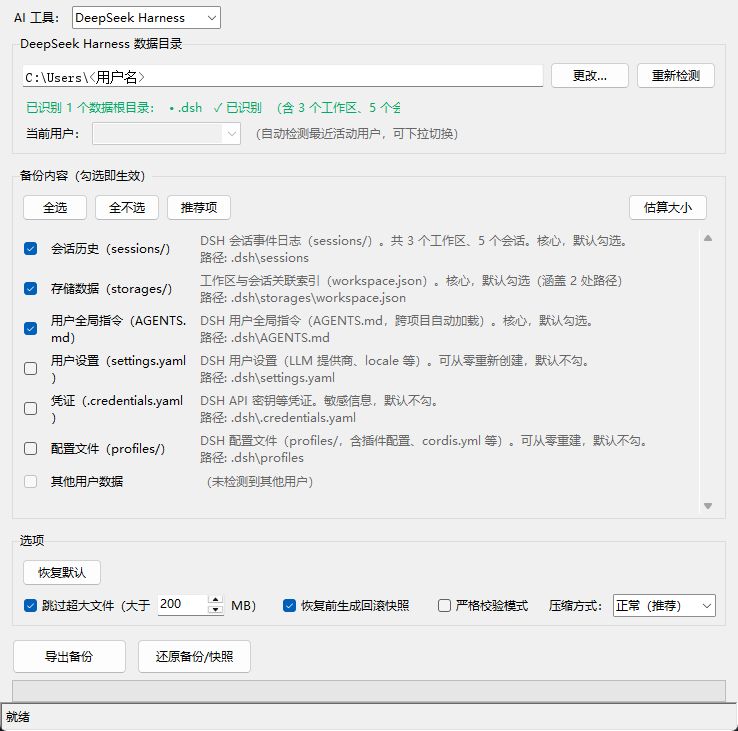

# ai-env-clone

> 跨电脑备份与迁移你的 AI 编程环境——AI 开发者的"手机克隆"工具。
> Backup & migrate your AI coding environment across computers. Like a phone transfer tool for AI devs.

[](https://github.com/yinlichaoxi007/ai-env-clone)
[](https://gitee.com/yinlichaoxi007/ai-env-clone)

## 简介

`ai-env-clone` 帮助你把本地 AI 编程工具（如 Qoder CN、CodeBuddy CN、Reasonix、DeepSeek Harness、WorkBuddy、TraeCode CN / TraeWork CN、ZCode）积累的**记忆（memory）**、**会话历史（chat history）**、**规则（rules）** 等用户核心数据，打包成一个离线备份文件，方便在新电脑上完整恢复，避免重新训练和丢失上下文。

- 🖥️ **双形态**：同一套核心逻辑，既提供命令行（CLI）也提供图形界面（GUI，基于 Python 自带的 tkinter，无需额外安装）。
- 📦 **零第三方依赖**：运行时不依赖任何第三方库，仅用 Python 标准库。发布版的**单文件 exe 双击即用、无需安装 Python**；从源码运行（`python -m ai_env_clone` 或 `run.bat`）则需本机已装 Python 3.10+。
- 🌐 **跨平台**：Windows / macOS / Linux 均可运行（GUI 在三大平台均可用）。
- 🔌 **可扩展**：以"适配器（adapter）"模式设计，新增一种 AI 工具只需添加一个适配器模块。
- 🛡️ **安全可靠**：恢复前自动生成回滚快照；SQLite 数据库使用在线备份 API 一致性快照；内置 Zip Slip 路径穿越防护。

## 支持的工具

> 定位：**支持「国内能正常使用的 AI 编程工具」**。不限定工具的国别或厂商——只要该工具在**国内网络环境下可访问、可测试**，无论其来自国内还是国外产品，都可纳入支持范围。反之，国内工具海外用户同样可用，本工具对海内外用户均有价值。

| 工具 | 形态 | 测试版本 | 状态 |
| --- | --- | --- | --- |
| Qoder CN（前 Lingma，JetBrains 插件） | 桌面 IDE 插件 | **3.3.3** | ✅ 已支持 |
| Qoder CN IDE（独立桌面客户端） | 独立 IDE | **0.4.3**（本机）/ **0.2.3 / 0.3.4**（另一台） | ✅ 已支持 |
| Qoder CN（桌面端 CLI / Agent 运行时） | CLI / 桌面 Agent | CLI **1.1.47 / 1.1.57** | ✅ 已支持 |
| CodeBuddy CN | 桌面 IDE | **1.106.1**（genie 版本 4.12.0） | ✅ 已支持 |
| Reasonix | 桌面 IDE | **1.21.5** | ✅ 已支持 |
| DeepSeek Harness（DSH） | CLI / Web 智能体框架 | **0.2.0-rc.2** | ✅ 已支持 |
| WorkBuddy | 桌面 AI 助手 | **5.6.2** | ✅ 已支持 |
| TraeCode CN（安装目录 `Trae CN`） | 桌面 IDE | **3.3.99**（构建版本 2.3.82600） | ✅ 已支持 |
| TraeWork CN（安装目录 `TRAE SOLO CN`） | 自主智能体形态 IDE | **0.1.69**（构建版本 2.3.87413） | ✅ 已支持 |
| ZCode（智谱） | 桌面 IDE / CLI | **3.14.4** | ✅ 已支持 |
| 其他国内可用工具 | — | — | 🚧 规划中，欢迎贡献适配器 |

> ⚠️ **版本说明**：上表仅列出作者**实测通过**的版本，读取方式为各工具本地安装目录中自带的版本清单（如 `resources/app/product.json`、`resources/build-manifest.json`）与系统「应用和功能」里显示的版本，不依赖联网查询。其他更高/更低版本未经测试，数据结构可能变化，使用前请先在本机做一次「导出 → 校验」验证。
> 部分工具同时存在「构建版本」与「应用版本」两个号（上表已并列标注）；不同形态（如桌面 IDE 与对应插件）可能共用同一套数据目录，本工具按各适配器探测到的数据根统一备份，无需用户区分具体产品形态。
> **版本表会随实测更新，且必须与代码行为一致**：表中数字取自本机三处可复核的证据——① 安装目录的 `product.json`（Trae 家族的 `version` 是 VS Code 基线号、应用号在 `appVersion`，构建号在 `manifest.json`）、② Windows「应用和功能」注册表登记值、③ 工具自己写出的状态文件（如 Qoder CN 的 `~/.qoder-cn/.qoder-app-status.json`）。**改动适配器时若涉及某版本的数据布局，必须同步本表与下方策略段**，不要留下「文档说 A、代码按 B 做」的错位。
> 其中 **Reasonix** 条目沿用此前实测记录（本机当前未安装该工具，适配器按官方数据布局实现）。
> 其中 **Qoder CN** 的版本号为**跨机器**实测并列：桌面客户端 `0.4.3` 采自本机（另有旧残留登记项 `0.1.2`），`0.3.4` 与 `0.2.3` 采自另一台电脑；CLI 号（`1.1.57` / `1.1.47`）为两台机器的既有记录，本机未再复采。**不同版本下同一数据根里的内容并不相同**——例如 `~/.qoder-cn` 根下的「新版产物族」（`projects/<key>/*.jsonl`、`plans/`、`tasks/`、`file-history/`、`canvas/`、`mcp.json`、`AppData/Roaming/QoderCN`）在一台机器上齐备、在另一台上可能一个都没有。这属正常现象，本工具一律**按存在性如实探测**（缺什么就显示「未找到」），不会因为某台机器缺少某目录而误判为数据丢失或探测失败；备份清单也只在目录存在时才勾选。
>
> ⚠️ **DSH `0.2.0-rc.2` 起有一处数据布局变更，直接影响备份条目**：旧版的全局设置文件 `$DSH_HOME/settings.yaml` **已被移除**（改为把配置存进各 profile 的 `profiles/<profile>/cordis.patch.yml`；旧文件在首次启动时被一次性导入后改名为 `settings.yaml.imported`，**干净安装则根本不会生成它**）。因此本工具**不再把 `settings.yaml` 列为备份条目**，改为备份 `profiles/<profile>/cordis.patch.yml`；判定依据与源码位置见 [`docs/local/新增工具适配核查.md`](docs/local/新增工具适配核查.md)。
>
> ⚠️ **DSH 同一版本内还有一处「存储布局升级」，旧文件会留在盘上不删**：会话投影缓存从**单文件** `storages/session_projcache.json` 改为**一条记录一份文件**的目录树 `storages/session_projcache/sessions/<id>.json`。DSH 的 `storage-json` 后端在迁移时**保持源文件不变**，因此那台机器上会长期并存「一个不再更新的旧单文件 + 一棵在写的目录树」——只按文件名找文件会**备份到那个死文件**（大小非零、界面显示「已找到」，备份看起来完全成功，还原出来却是空的）。本工具已改为指向目录树，并把它列为**默认不勾**项：它是**可从会话日志重建的纯缓存**（官方文档：「日志领先，缓存跟随」）。若在其它工具的数据根里也见到「同名单文件 + 同名目录并存」，按同一思路先比 `mtime` 再决定指向谁。
>
> 📛 **产品名以「用户看到的」为准，不是安装目录名**：Trae 家族的两个安装目录分别叫 `Trae CN` 与 `TRAE SOLO CN`，但产品自身向用户展示的名字是 `TraeCode CN` 与 `TraeWork CN`（`product.json` 的 `win32NameVersion`，与系统「应用和功能」列表一致）。本工具统一展示后者；适配器内部标识（`trae-cn` / `trae-solo-cn`）保持不变，因此既有备份包与偏好缓存不受影响。

### 跨软件「数据导入」能力

除整库备份 / 还原外，本工具还支持把**其它软件**的历史会话，按**当前所选工具的原生格式**写出（见 [跨软件会话导入](#跨软件会话导入)）。在主界面选中某个工具后，「数据导入」区会直接列出**该工具可导入的来源软件、实测版本、可导入的数据范围与状态**：

| 目标工具（导入到） | 可导入来源 | 说明 |
| --- | --- | --- |
| Reasonix | CodeBuddy CN / WorkBuddy / ZCode / DeepSeek Harness | 明文 JSONL，无损 |
| CodeBuddy CN | Reasonix / WorkBuddy / ZCode / DeepSeek Harness | 需项目路径同源，否则可能不被索引 |
| WorkBuddy | Reasonix / CodeBuddy CN / ZCode / DeepSeek Harness | 同时登记 workbuddy.db 会话索引 |
| DeepSeek Harness | Reasonix / CodeBuddy CN / WorkBuddy / ZCode | 需 zstd 后端；会话写为 `session.v3.jsonl.zstd` |
| ZCode | —（仅可作来源，反向导出） | 写出格式待实测，为避免写坏其库暂不作为导入目标 |
| Qoder CN / TraeCode CN / TraeWork CN | —（仅整库备份 / 还原） | 会话正文取不出（Qoder 旧版为**列级密文**、Trae 为加密库），无法跨软件转换 |

> **为什么有些工具不能互相导入？** 会话正文的形态决定了一切：明文 JSONL / JSON / SQLite 可解析、可复写，因而能跨软件迁移；而 Qoder 旧版 `local.db` 的**会话正文列是列级密文**（容器本身是标准 SQLite，`chat_session` / `agent_memory` 等元数据与记忆表均为明文），Trae 家族（`ModularData/ai-agent/database.db`）则是产品侧加密库——两者正文都取不出，本工具只能做整库不透明备份 / 还原。这是产品设计造成的，不是本工具的缺陷。


## 备份范围与默认勾选策略

本工具统一按以下原则划分「备份内容」的默认勾选状态（各适配器一致，适用于所有已支持的工具）。

判据是**重新获取的成本**，而不是「能不能重建」——很多内容理论上都能重建，但要用户在新机器上逐项重配一遍，那就等于「还原完还不能开工」：

- ✅ **默认勾选（推荐项）**，两类：
  1. **无法从零重复创建的用户核心数据**：**会话历史、记忆、规则**——丢失即不可逆；
  2. **缺失后需要重新逐项配置、才能开始工作**的**设置类**：**设置、skill、灵感、自定义模型配置**——这类理论上能重建，但重建成本高，故一并默认勾选，让还原后**立刻能开工**。
- ⬜ **默认不勾选（可选）**：**插件、扩展、MCP、索引、编排记录（任务/团队）**——重新下载或重新授权即可恢复，且往往体积大；默认不勾，按需自行勾选。
- 🚫 **不列入备份选项**：**本地缓存、运行态记录、日志、凭证**——缓存/运行态/日志纯属程序自身的临时数据，与用户数据无关，不生成备份条目；**凭证**（登录态、机器绑定令牌）跨机本就要重新登录，带入无意义。

**条目取舍的总规则（2026-10-02 定，适用于所有已支持的工具）：**

1. **当前支持备份的版本中不存在的条目，不列为备份选项。** 典型是 DSH `0.2.0-rc.2` 起移除的 `settings.yaml`：它在**当前新版的任何机器上都不存在**（不是「某台机器缺」），故不生成条目。
2. **仅当满足下列之一时，才列为条目，且一律默认不勾选**：
   - **(a)** 明确「**旧版本迁移后仍然需要**」的——例如各工具的**迁移标记**必须与数据同进同出，否则产品会认为「已迁移」而跳过导入；
   - **(b)** 「**把新版的备份还原到旧版产品、为保证数据正确必须依赖**」的。
3. **默认勾选的门槛更高：必须同时满足「对当前支持的版本是必需的」且「能正确还原」。** 只满足一半就不算推荐项——例如「内容必需、但还原侧尚未实现合并、直接覆盖会破坏目标机已有数据」的条目，在还原逻辑补齐前不应默认勾选。

> ⚠️ **必须区分两种「不存在」，处置完全相反**：
> - **版本已移除**（产品新版不再产生、也不再读取该文件）⇒ 按规则 1 **删条目**；
> - **本机未使用该功能 / 该工具未安装**（产品当前版本仍有该文件）⇒ **保留条目**，由界面按存在性显示「未找到」，既不报错也不推断数据丢失。
>
> 判定「属于哪一种」必须有**可复核的证据**（产品源码、官方设计记录、版本清单），**不能只看本机磁盘有没有**——否则会把「用户没启用」误判成「版本没了」，删掉本来有用的备份项。

> 注：不同工具内部目录命名不同（如「设置」可能是 `argv.json` / `config.toml` / `settings.json`），但均按上述类别归入对应勾选状态。

> ⚠️ **skill 只备份「本机 skill 数据」，不备份「skill 市场数据」**。技能市场的**本地镜像与目录索引**属于「重新下载即可恢复」的内容，不进备份范围。最典型的是 CodeBuddy 的 `~/.codebuddy/skills-marketplace/` —— 本机实测它是**整份技能市场的本地镜像**（`skills/` 295 个技能目录 ≈ 市场清单 293 条全量、`icons/` 137 个市场条目图标、`marketplace.json` 410 KB 目录索引，合计 5019 文件 / 57.1 MB），已从备份条目中移除。反过来说，WorkBuddy 的 `~/.workbuddy/skills/` 装的是**本机安装的技能本体**（含你自己写的技能），照常默认勾选；Trae 家族的 `~/.trae-cn/skill-config.json`（本机技能的启用 / 禁用 / 删除记录，仅 132 字节）也是**本机状态**，同样默认勾选。判断依据是**目录里装的是什么**，不是目录名里有没有「skill」。

> ⚠️ **含凭证的设置文件导出时一律脱敏**：像 CodeBuddy/WorkBuddy 的 `models.json`、Reasonix 的 `config.toml`（含 MCP `[[plugins]]` 段）这类「设置类」文件里可能写着明文 apiKey / token。既然它们**默认勾选**，默认备份就必须保证**不含明文密钥**：导出时把「键名像凭证」的值替换成 `***REDACTED***`（键名、缩进、注释、结构全部原样保留），还原后需在目标机手动补填。这一条与「凭证不入包」是同一原则的两面。

**一处显式例外（默认勾选）：「IDE 工作区记录」。** CodeBuddy CN 的 `%APPDATA%\CodeBuddy CN\User\workspaceStorage\*\workspace.json`（每个仅 50~70 字节）本身既不是会话也不是记忆，但它记录「哪个工程文件夹对应哪个工作区」——而 CodeBuddy 的会话是按 `md5(项目路径)` 派生的工作区 id 索引的（**哈希不可逆**），这份记录是**跨机还原后把会话正确归回原工程工作区的唯一结构化映射**。它不含任何 IDE 运行态（同目录的 `state.vscdb`、`globalStorage/storage.json` 属运行态，**不进包**），因此按「无法从零重复创建、且能让用户数据正确落位」归入默认勾选。

Trae 家族同理：`%APPDATA%\<产品名>\User\workspaceStorage\*\workspace.json`（内容形如 `{"folder": "file:///d%3A/project/demo"}`）也按存在性默认勾选。它在这里是**唯一**的路径线索——Trae 的智能体会话库存放在 `ModularData/ai-agent/database.db`，是**产品侧加密**的（实测 11.7 MB 主库 + 12.9 MB WAL 里，一个 ≥24 字符的可打印片段都没有），既取不出会话正文、也挖不出任何路径。**这份记录只覆盖「在源机器上打开过文件夹」的工程**；本机实测恰好为空（只留下一个空窗口目录，连 `workspace.json` 都没有），所以它并非一定存在。

**另外，只要勾选了「集中会话」，导出时会自动附带一份「会话 → 原始工作区路径」映射**（包内 `…/CodeBuddyIDE/<uid>/session-workspaces.json`，同时在本机留一份）。它把每个工作区的原始工程路径显式记下来，随包携带、还原后落回原位 —— 于是**不必依赖「先还原 IDE 记录、再导入会话」这个顺序**，跨机也能让界面说清「这条会话原本属于哪个工程」。能确定的写路径；**确定不了的仍保留正文候选路径**（只是线索，不自动采用），避免出现「连提醒都做不到」的情况。

> 老实说一句：这份映射**解决不了全部**。本机实测（21 个工作区 / 31 条会话）只有 **1 个工作区 / 9 条会话（29%）**能还原出路径，其余 20 个工作区对应的工程目录早已不在磁盘上、正文里也没有它的完整形态。所以推不出来的那些，改由**导入前显式确认**兜底：列出这些会话、点明它们会落到工具默认目录、并把候选路径列出来供你一键采用 —— 不再静默换落点。

## 携带源设备信息（默认告知，不阻拦）

备份包里**本来就会**带走一些源机器信息——这不是本工具新引入的，而是会话/记录自身的性质：

| 形态 | 来源 | 实测 |
| --- | --- | --- |
| 会话正文里的**文件绝对路径** | 工具调用参数、命令输出、文件快照 | CodeBuddy `history/**` 24519 个 JSON 中 20564 个命中；`check-point/**` 186/218；Qoder `project_sessions` 71/80；WorkBuddy `projects` 11/17、`workspace_sessions` 16/80 |
| 归档结构里的**用户名 / 登录用户标识** | 归档相对路径含 `…\Users\<用户名>`、`Data/<登录用户 uuid>/…` | 所有条目 |
| **IDE 工作区记录** | 主动备份的 `workspace.json`（CodeBuddy 与 Trae 家族，见上节） | 内容即工程文件夹路径 |
| **会话原始工作区映射** | 本工具导出时生成（`session-workspaces.json`，见上节） | 内容即工程文件夹路径 + 推不出来时的正文候选 |

这些信息是**有价值的**（还原后把会话归回原工作区的依据），但把包分享出去时会一并外传，所以本工具按「**默认告知、不阻拦**」处理，在四处明示：

1. **备份内容**里那一行：会携带的条目直接标注「携带源设备信息：…」（勾选那一刻就是决定要不要把包发出去的场景）；
2. **备份完成**提示框：列出本次包内各条目携带了哪类信息，并提示分享前留意；
3. **还原确认框**：说明本包携带多少处、会写回本机对应位置（如 IDE 记录落到 `%APPDATA%` 下），属写入工具目录之外的动作，提前说明；
4. **备份包详情**（备份浏览器右侧）：新增「携带的源设备信息」一节，逐条列出；**旧备份包没有该字段时不显示空壳段落**（不做无内容的提醒，也不给出「此包很干净」的误导）。

实现上，条目用 `BackupItem.carries_origin` 声明（措辞统一取 `core.ORIGIN_NOTE_*`），导出时按「**只登记确实存在的条目**」写入清单的 `origin_info` 字段；旧版本读到此字段直接忽略（向下兼容）。**未实测到路径的条目一律不标注**——避免「凡是会话类都说带路径」这种无根据的宽泛断言（例：CodeBuddy `plan-task` 实测 0/5 命中；Trae `ai_agent_db` 早先看似有 45 处命中，严格模式复核后为随机二进制字节的假阳性，故不标）。

## 安装

### 方式一：下载发布版（推荐，无需 Python）

到 [Releases](https://github.com/yinlichaoxi007/ai-env-clone/releases) 下载对应平台的单文件程序（发布产物会自动同步到 [Gitee Releases](https://gitee.com/yinlichaoxi007/ai-env-clone/releases)，国内网络可优先从 Gitee 下载）：

- **Windows (x64)**：`AiEnvClone-windows.exe`，双击运行。
- **macOS（Apple Silicon / Intel 通用）**：`AiEnvClone-macos-*.app.zip`，解压后将 `AiEnvClone.app` 拖入「应用程序」或右键打开。
  - 首次打开若提示「无法验证开发者」，右键 `AiEnvClone.app` →「打开」即可（本程序未购买 Apple 开发者签名证书，属正常提示）。
- **Linux (x64)**：`AiEnvClone-linux`，终端赋予执行权限后运行：
  ```bash
  chmod +x AiEnvClone-linux
  ./AiEnvClone-linux
  ```

> 各平台分发与运行方式均经打包流程验证可产出；**实际运行仅在 Windows x64 上做过真机端到端实测**。macOS / Linux 暂无对应真机设备，未做端到端实测，但三平台代码路径（路径解析、缓存目录、适配器探测、DPI 感知等）已由**跨平台单元测试覆盖**（测试中以 mock 平台分支逐一断言 Windows / macOS / Linux 的路径布局与行为），打包流程同样跨平台通用。

### 方式二：从源码运行（需 Python 3.10+）

```bash
git clone https://github.com/yinlichaoxi007/ai-env-clone.git
cd ai-env-clone
python -m ai_env_clone                    # 启动 GUI
```

### 方式三：自行打包各平台可执行程序

```bash
pip install -r requirements.txt
python build_exe.py --name AiEnvClone            # 在当前平台产出对应格式的可执行程序，位于 dist/
```

> 在 Windows 上产出 `AiEnvClone.exe`，macOS 上产出 `AiEnvClone.app`，Linux 上产出 `AiEnvClone`（无后缀）。CI 中的 `build-release.yml` 即在三平台（Windows / macOS / Linux）分别调用此脚本并汇总发布（macOS 按 arm64 与 x86_64 各产一份）。

- **Windows 一键打包**：双击仓库内的 `build.bat` 即可（自动检查 Python → 安装 `requirements.txt` 依赖 → 调用 `build_exe.py`，产物位于 `dist/AiEnvClone.exe`）。该 exe 可拷贝到任何无 Python 的 Windows 电脑双击运行。

## 使用

### GUI（图形界面）

```bash
python -m ai_env_clone
```

启动后：顶部「AI 工具」下拉选择要备份 / 迁移的工具 → 自动检测数据目录 → 勾选要备份的内容 → 点击「导出备份」生成 zip，或「还原备份包」恢复。



GUI 界面要点：

- **AI 工具切换**：顶部下拉切换已支持的 8 个工具（Qoder CN / CodeBuddy / Reasonix / DeepSeek Harness / WorkBuddy / TraeCode CN / TraeWork CN / ZCode）；切换后「数据目录」「备份内容」「数据导入」「当前用户」等区域按所选工具刷新。
- **导入对话框的目标工作区自动判定**：会话列表支持 `Ctrl` / `Shift` 多选一次导入多条；「目标工作区」默认只读展示自动判定结果（来源标注为「沿用会话自带工作区」或「工具默认」），**不需要填写**。仅当勾选「手动指定工作区」时才出现输入框，并常驻红色警示——手动值会覆盖本次导入的**全部**会话（含自带工作区的）——导入前再确认一次；工作区在目标机不存在时同样先询问是否创建。
- **数据根识别状态区**：位于「数据目录」与「当前用户」之间，自动列出该工具在用户主目录下识别到的各个数据根目录（含完整相对路径），未找到的根以灰显 `✗` 标注；若完全未识别到数据目录会提示需手动指定。该区域最多显示约两行，根目录过多时显示竖向滚动条，避免把主窗口整体高度撑高。
- **备份内容路径可见**：每个备份项的说明文字后附带其相对于数据目录的具体路径，方便确认备份范围。
- **未找到项标红**：当数据目录未正确识别时，备份内容中找不到的每一项会标红并注明「（未找到）」，备份内容区右上角同时显示「N 项未找到」；已勾选项保持不变，仅作提示，不会自动取消勾选。
- **估算大小**：点击「估算大小」按钮可预估所选备份项打包后的体积。
- **数据导入区**：位于「备份内容」与「选项」之间，随所选工具刷新。直接列出**该工具可导入的来源软件、实测版本、可导入的数据范围与状态**（`支持导入` / `仅备份/还原` / `待支持`）；支持导入时「导入会话…」按钮可用，点击即打开导入对话框；「导入说明」按钮弹出全部工具的支持矩阵。
- **仅特定工具显示的行**：选中 **DeepSeek Harness** 时出现「会话健康」行（检测未分组会话 / 旧格式 replayState 等）；选中 **Qoder CN** 时出现「历史会话诊断」行（对比新版 `main.sqlite` 与旧版 `local.db` 两处数据根及导入账本，给出「导入后仍看不到历史会话」的成因结论）。这两行对其他工具隐藏，不影响各区域自适应布局。
- **高分屏与窗口高度适配**：窗口声明 DPI 感知（Per-Monitor v2），缩放系数超过 100% 时不会被系统虚化放大。**首次打开的默认高度为屏幕高的 75%**（下限 460px），各工具完全一致、与内容多少无关——内容少的工具也不会缩成一小条；之后高度**完全由你控制**：拖高时备份内容区与数据导入说明区**按比例放大**（一屏能看到更多条目），拖矮时**按比例压缩**（为下方区域腾空间）；压到各自下限仍装不下时出现竖向滚动条，**进度条与状态栏始终固定在窗口最下方**，任何窗口高度下都不会被裁掉看不见——小尺寸屏幕上也不会因窗口超高而被遮挡。默认高度按屏幕**比例**而非固定像素计算，故在任意 DPI 缩放下占屏比例恒定。备份内容区高度只取决于窗口高度、与工具项数无关。窗口宽度不足时内容区出现横向滚动条，各区域的文字与控件不会被裁掉。

也可双击仓库内的 `run.bat`（Windows，需本机已装 Python 3.10+）一键启动。

### CLI（命令行）

> 当前 CLI 入口正在完善中，核心逻辑层 `ai_env_clone.core` 已完全解耦，可独立调用 `export_backup` / `import_backup` / `inspect_backup`。

```bash
# 备份
python -m ai_env_clone --backup --out ./my-backup.zip

# 恢复
python -m ai_env_clone --restore --in ./my-backup.zip
```

（具体 CLI 参数以发布版本为准，请关注 Release Notes。）

### 备份包说明

- 备份产物是一个标准 `.zip` 文件，文件名形如 `<工具名>_backup_<时间戳>.zip`（例如 `qoder_backup_20260805_095519.zip`）。包内含 `<工具名>_backup_manifest.json` 清单，记录 `kind`（类型）、`tool`（工具名）、`created_at`（创建时间）、`source_root`（来源目录）、`items`（包含模块）、`origin_info`（该包携带的源设备信息，见「携带源设备信息」一节）、文件数等。
- 在「备份浏览器」（点「还原备份包」打开）中可查看明细、校验完整性、选择还原。校验结果会显示在列表「完整性」列，切换选择后仍可见。
- 恢复时会**自动覆盖**同名文件，并在覆盖前在备份目录下的 `backup/<工具名>/` 生成 `<工具名>_rollback_<时间戳>.zip` 回滚快照，可随时还原到恢复前状态，也方便按文件时间信息对比选择。备份默认同样导出到该 `backup/<工具名>/`。
- **备份目录位置**：与启动方式同级。
  - 源码模式（`python -m ai_env_clone` / `run.bat`）：`<仓库根>/backup/<工具名>/`。
  - 打包模式（单文件 exe / app / 二进制）：可执行程序是独立分发物，备份目录放在 **exe 同级**的 `backup/<工具名>/`（如 `dist/backup/qoder/`），让程序与它的备份数据在一起，便于随程序一起拷贝/迁移。重打包（`build_exe.py` / `build.bat`）只会覆盖 exe 本身，不会清空 `backup/` 子目录，备份数据安全。
- **防误还原**：还原时以包内 manifest 的 `kind` 为准，仅改文件名无法骗过校验；若包内记录的 `source_root` 与当前还原目标不一致，会弹窗二次确认，防止覆盖错误目录的数据。备份与回滚快照均可还原。
- **关于「覆盖 vs 融合」**：恢复时同名文件是**整体覆盖**（覆盖前自动生成回滚快照，可随时还原到覆盖前状态），而不是按内容结构做「追加不同、覆盖相同」的融合。这是**各 AI 工具数据格式的限制**：会话日志是压缩/加密/二进制格式（如 DSH 的 `session.jsonl.zstd`、Qoder 旧版 `local.db` 的会话正文列），本工具无法读取其内部结构去逐条合并；对明文 JSON/JSONL 虽可解析，但半吊子的「部分融合」可能造成同一会话在不同机器上内容不一致、甚至让工具无法正常打开数据，比整体覆盖更危险。因此**多台电脑使用时应「串行」而非「交叉并行」**——精确的粒度是**同一工作区的同一会话**：
  - **例外（安全的索引合并）**：面向「全局索引文件」这类**纯 JSON、结构可完整解析且合并语义明确**的文件，本工具会做**合并而非整体覆盖**，以保住目标机器原有的同名条目。典型即 DSH 的 `storages/workspace.json`（见下节）。
  1. **同一工作区的同一会话**，同一时间只在一台电脑上使用（不同工作区、不同会话互不影响，可并行）；
  2. 换电脑前，先在当前电脑**导出备份**；
  3. 到新电脑后，先**还原该备份**再开始使用；
  4. 切勿在两台电脑上交叉使用同一个工作区/会话后互相还原——覆盖会丢失其中一侧的增量，融合则可能产生冲突数据。
  - harness 自身的设置（含自定义模型配置，如 DSH 的 `profiles/<profile>/cordis.patch.yml`）理论上可按 key 融合，但**没必要**：设置本就应随会话一起串行修改、随备份整体迁移，恢复时同样整体覆盖同名文件即可，避免跨机器设置漂移。
  - 若某台电脑上已经产生了新数据（还原目标里已有备份之外的会话/记忆），还原前请先手动导出该电脑的备份（或直接使用自动生成的回滚快照），确保新旧数据各有一份可回退的副本，再决定保留哪一侧。

### 跨软件会话导入

「备份 / 还原」解决的是**同一软件**跨电脑迁移；「跨软件会话导入」解决的是**把一个软件的会话搬到另一个软件里**——以目标软件的**原生格式**写出，使其能被目标软件像原生会话一样打开（正文、推理过程、工具调用尽量保留）。目标工作区**默认自动判定**（沿用源会话自带的工作区，取不到则用该工具的默认落点），只有勾选「手动指定工作区」才会覆盖。

在主界面选中目标工具后，「数据导入」区会列出：

- 可导入的**来源软件**与**实测版本**；
- 每个来源的**可导入数据范围**（目前为历史会话；CodeBuddy 另含规则 / 记忆文件的整文件拷贝）；
- **状态**（`支持导入` / `仅备份/还原` / `待支持`）与针对性说明（落点要求、是否需要 zstd 等）。

点击「导入会话…」即打开导入对话框：选择来源软件与来源目录 → 扫描出可导入会话（`Ctrl` / `Shift` 可多选，一次导入多条）→ **目标工作区自动判定，无需填写**（该栏只读展示**实际会落到的**工作区，并随选中项实时刷新）→ 导入。

#### 目标工作区：默认自动判定

把会话写进目标工具时**必须决定它归到哪个工作区**（填错就等于「写了但看不到」）。本工具把这一步收敛成一条规则，默认不需要用户输入（实现见 `ai_env_clone/workspace_plan.py`）：

1. **源会话自带工作区** → 直接沿用（尽量与源机器路径同源，一次做对）；
2. **源会话只记了「派生 id」形态的工作区**（目前仅 CodeBuddy 的 `workspaceId`，= `md5(项目路径)`，**不可逆**）→ 先把它**还原**回路径再沿用（见下方说明）；还原不出才走第 3 条；
3. **源会话没有工作区（或工作区还原不出路径）** → 用该工具「无工作区会话」的默认落点（见下表），并在预览里**写明成因**；
4. **勾选「手动指定工作区」** → 本次导入的**全部**会话都落到这一个工作区，**包括本来就自带工作区的会话**——界面常驻红色警示，导入前还会再确认一次。

| 目标工具 | 工作区载体 | 沿用源会话的什么 | 无工作区时的默认落点 |
| --- | --- | --- | --- |
| Reasonix | 项目名（scope） | 源 scope；取不到时用源路径的末级目录名 | `global-workspace` |
| CodeBuddy CN | `workspaceId` | 源 workspaceId；否则由源路径派生（`md5(路径小写、反斜杠)`） | 固定的 `imported-sessions` 工作区 |
| WorkBuddy | 工作区路径（cwd） | 源会话的 cwd（CodeBuddy 来源时先把 `workspaceId` 反查成路径） | `~/WorkBuddy/<时间戳>`（与产品自身 playground 一致） |
| DeepSeek Harness | 工作区路径（cwd） | 源会话的 cwd | 用户主目录 `~` |

- **CodeBuddy 的 `workspaceId` 不能当路径用**：它是 `md5(项目路径小写、反斜杠)`，**不可逆**，而 WorkBuddy / DSH 的落点必须**是路径**。所以判定落点时会尽力把 id **还原成路径**，且**只有能验证的才认**：
  1. **备份包自带的「会话原始工作区映射」**（包内 `…/CodeBuddyIDE/<uid>/session-workspaces.json`）：备份时就把映射记进了包，随包携带、还原后落回原位。**不依赖任何本机状态，也不依赖「先还原、后导入」的顺序**，故最优先；
  2. **本机 IDE 记的「已打开工程」**：读 `<应用数据根>/CodeBuddy CN/User/workspaceStorage/*/workspace.json` 与 `User/globalStorage/storage.json`，候选路径按同一规则求 `md5` 与 `history/<workspaceId>/` 对齐；
  3. **会话正文里的路径 + 哈希校验**：`index.json` 没有结构化路径字段，但正文（`messages/*.json`）与 `check-point/` 快照里大量含绝对路径（实测本机 24519 个 history JSON 中 20564 个命中），而这两处**都在备份范围内**。做法是把挖出的候选逐个求 `md5`，对得上才算（哈希不可伪造，因此**不猜路径**）。

  三条都失败时退回默认落点，**但导入前会弹框显式确认**（列出这些会话、点明会落到哪个默认目录、附上候选路径；选「否」即可改用「手动指定工作区」），预览里也写明成因；绝不静默换落点，也绝不把猜出来的路径当结论。

  > 如实说明覆盖率：本机实测 **21 个工作区 / 31 条会话中只有 1 个工作区（9 条会话，约 29%）**能还原出路径；第 3 条在本机数据上的**净新增覆盖为 0**（唯一能对上的那个工作区，第 2 条已覆盖）。其余工作区对应的工程目录早已不在磁盘上，正文里也没有它的完整形态 —— **这类不可还原是数据本身的限制，不是解析缺陷。**
- **落点「推不出来」时会先问你**：有些会话原本**有**工作区，但只留了一个不可逆的 id（`md5(项目路径)`），连备份包也没能还原成路径。这时**导入前会弹框**列出这些会话（附 id 前 8 位）、点明它们会落到工具的默认目录（WorkBuddy 还会现造一个带时间戳的新目录），并附上正文里出现过的候选路径：`是` = 接受默认落点继续，`否` = 改用「手动指定工作区」（候选已预填进下拉），`取消` = 中止本次导入。
- **工作区不存在时不会静默创建**：导入前弹窗询问一次，**逐条注明该落点的来源**（「源会话还原」/「工具默认」/「手动指定」），`是` = 先创建目录再导入，`否` = 不创建但仍按原落点导入（目标工具写出时会自建自己需要的目录），`取消` = 中止本次导入。
- **多选时逐条判定**：每条会话按各自自带的工作区落点，互不影响；只有勾选「手动指定」才会把它们合并到同一个工作区。
- **预览只显示「实际会落到的」，并交代它从哪来**：单选（或未选）时显示判定出的那一个工作区（标注「沿用会话自带 / 工具默认」）；多选且落点不一致时只提示「存在 N 个不同的工作区」，**不挑一条显示**（挑一条会被误读成统一落点）；多选但落点一致时显示该落点，**并说明它是不是各会话自带的**——若该值只是该工具「无工作区会话」的默认落点（WorkBuddy 更是本次现造的时间戳新目录），会额外标注「自动判定，非手动指定」。这条标注是必要的：勾选「手动指定」时的**预填值就是自动判定值**，两者字符串一模一样，只说路径会被读成「我上次手动填的那个没清掉」。
- **未勾选「手动指定」时输入行整体收起**（而不是置灰保留）：遗留的上次手动路径会让人误以为它就是本次实际落点。勾选后才显示输入行并预填当前自动判定值；勾了但清空内容则按自动判定走，并在预览里明确提示。
- **落点目录名与产品自身一致**：WorkBuddy 的 `projects/<工作区编码>` 与 DSH 的 `sessions/<工作区编码>` 都按各产品自己的**真实编码规则**推导（前者是「盘符小写 + 分隔符换成 `-`、其余原样保留，中文保留」；后者是「分隔符换成 `-`、非 ASCII 编码为 `~码点~`」），避免导入的会话在目标工具里散落到「另一个工作区」。这两条规则均由本机真实目录名回归验证（WorkBuddy 11/11、DSH 6/6）。

实现要点：

- **不覆盖目标已有会话**：新会话一律使用全新生成的 id（WorkBuddy / CodeBuddy 为 UUID，DSH 为 `session-<uuid>`，Reasonix 为时间戳 id），天然避开碰撞。
- **写「原生落点」而非只写文件**：部分工具界面按索引读取，只落文件是看不到的。因此 WorkBuddy 会同时把会话登记进 `workbuddy.db` 的 `sessions` 表（`insert or ignore`，绝不改写既有行）；DSH 会同时把会话登记进 `storages/workspace.json` 的工作区索引（**界面列表靠的就是它**），并尽力在新的 `session_projcache*` 缓存里补一条标题记录（该缓存可由 DSH 自行从日志重建，且换布局后旧单文件的写入只在目录树尚不存在时生效，故属「尽力而为」）。CodeBuddy / Reasonix 则遵循其「项目路径 / 工作区」派生规则，落点不一致会明确提示。
- **只读解析来源**：ZCode 的 `db.sqlite` 一律以 `mode=ro` 只读打开，绝不写入来源库。
- **中文/长文本安全**：DSH 的会话文件是**多帧** Zstandard 流，本工具按多帧语义整体解压（早期实现只解首帧，会把 4MB 的会话误判为「无消息」，已修复）。
- **DSH 需要 zstd 后端**：读 / 写 DSH 会话都依赖 `zstandard` / `pyzstd` 模块或系统 `zstd` 命令；缺失时导入会明确报错（而非静默产生坏数据）。

> 导入是**单向、一次性**的：它把源会话「复制」成目标工具的原生会话，不会删除或改动来源数据，也不会让两侧保持同步。若同一会话需要长期在多个工具中使用，请重复导入，或改用「备份 / 还原」的串行策略。


部分工具的会话 / 记忆按**登录用户 UUID** 分目录存放（例如 CodeBuddy 的 `CodeBuddyExtension/Data/<uuid>/CodeBuddyIDE/<uuid>/`）。备份把该 UUID 固化进归档相对路径，直接按原路径还原到新电脑会写进一个**当前登录用户读不到的「死目录」**——表现为「历史会话列表看得到、点开却没内容」。

还原时本工具会自动把旧 UUID 重映射为本机**当前登录用户 UUID**（启发式取该数据目录下最近活动的 UID），确保会话落到本机工具实际读取的目录。若本机从未登录过该工具（取不到 UUID），则保持原路径、不做重写，至少不破坏备份。

### 跨电脑还原：全局索引文件合并

某些工具的工作区 / 会话名**不只靠目录遍历得到**，还依赖一个全局索引文件（例如 DSH 的 `~/.dsh/storages/workspace.json`，记录工作区名 → 会话 ID 列表；工作区名来自索引而非目录名）。若还原时直接整体覆盖写入备份里带来的索引文件，会**抹掉目标机器原本的其他工作区 / 会话**，使它们在界面里变成「未分组 / 找不到」（磁盘内容都在，只是索引里查不到本机条目）。

还原时本工具对这类**纯 JSON、结构可完整解析且合并语义明确的全局索引文件**走**合并而非覆盖**：以目标机器还原前的索引为基底，并入备份里带来的源条目，列表类字段去重合并，**绝不删除本机原有的条目**。其中每个条目的 `path` / `title` 等定位字段始终采用**本机真实路径**（备份里固化的是源机器绝对路径，跨电脑无效，故不采用），其余可合并字段并入。这样源机器迁移来的条目、与目标机器原本的条目可共存，都不会变成「未分组」。具体哪些索引文件参与合并由各工具适配器声明（见 `restore_index_merge_paths` / `restore_index_merge`）。

### DSH 旧会话「未分组 / 无法加载」检测与修复

上面「合并」解决的是**还原时**防止未分组；但历史遗留的**已存在**问题仍需单独处理：磁盘上明明有会话目录（`~/.dsh/sessions/--...--/<session-id>/`），`workspace.json` 索引却查不到——DSH 界面就把这些会话归到「未分组」（磁盘内容都在，只是索引缺登记）。成因包括旧版本、崩溃、手工拷贝、或此前还原时索引被整体覆盖过。

会话文件内容也可能处于新版本**拒读**的形态，升级后历史会话直接打不开。DSH 对 `replayState` 有两道独立校验，旧数据可能倒在任意一道上：

- **扁平 `replayState`（格式校验）**：旧构建（`0.1.0-rc.x`）写成 `{kind:'pi-ai', version:1, ..., blocks:[...]}`（包络拆分前形态、无 `response` 成员），官方校验只接受 `{response, blocks}` 信封，报 `replayState has unexpected member "kind"`；
- **镜像不一致（加载校验）**：`message.source.replayState` 必须与「从内嵌 stream 重组出来的 replayState」完全相等（后者就是 finish 块里那份的原样回显）。**只改一侧必然报** `replay state disagrees with its embedded stream`——本工具旧版只升级 source 一侧、漏掉内嵌 stream 的 finish 块，正是这个报错的成因；
- **同一步内重复宣告的 tool-call id**：`assistant/message` 里两次宣告同一个 `callId` 时，迁移会报 `repeats advertised tool call`。

前两类都能**修数据**解决：把同一事件里出现的每一处扁平 `replayState`（`message.source`、内嵌 stream 的 finish 块、v0 的 chunk）用同一纯函数升级成**同一个** `{response, blocks}` 信封——除 `blocks` 外的字段整体挪进 `response` 半区，不新增、不改写内容；v0 形态无内嵌 stream，单侧升级即可（迁移器会自动把它复制进合成 stream 的 finish 块）。max-tokens 剪枝场景需要两侧取**不同**的值（stream 侧保留全量、source 侧随内容剪枝），本工具**跳过并上报**，绝不猜测改写。第三类给后续重复项加 `#n` 后缀并同步重映射 `tool/call` / `tool/result` 里的 id（**会改写数据内容**，故默认关闭）。升级语义以**未打补丁的官方构建真实加载**为验收标准（沙箱 `DSH_HOME` + 真实 Web API 逐会话验证通过、无回归），不再以 `第三方修复脚本` 的 `tools/会话数据修复.mjs` 行为为准——该脚本只升级 source 一侧，正是把会话改坏的来源。

另外，DSH 一个会话目录内可能存在**多个格式代际**（`session.jsonl.zstd` = v0、`session.v1.jsonl.zstd` … `session.v2.jsonl.zstd`），加载器只读**版本号最高**的那个；本工具按同一规则定位生效文件，因此「只有 `session.v2.jsonl.zstd`」的会话也能被发现（只看 `session.jsonl.zstd` 会漏掉这类会话，本机实测曾漏 5 个）。

在主界面下拉选择 **DeepSeek Harness** 后，数据目录区域会出现两个按钮和一个复选框（仅 dsh 显示，切换其他工具自动隐藏，不影响各区域自适应布局）：

- **「检测会话健康」**：扫描全部会话目录并与 `storages/workspace.json` 交叉核对（**内容扫描覆盖全部会话，不只未分组**），报告：
  - 未分组会话数量（及其中多少可自动归属、多少需人工确认）；
  - 索引结构问题（如 `workspaceIds` 引用不存在的记录）；
  - 旧格式（扁平 `replayState`）会话数量；
  - 含同一步重复 tool-call id 的会话数量；
  - 子代理描述符不兼容会话数量（`subagent/descriptor` 的 `version` 不是官方迁移要求的 3，会话无法加载）——**只检测标记，暂不自动修复**。
- **「同时修复重复调用 ID（会改写数据）」**：复选框，**默认不勾选**。勾选后修复流程才会处理重复 tool-call id（有语义改动，id 会被加 `#2`/`#3` 后缀）；不勾选则只做 replayState 信封升级与索引归属。
- **「修复未分组会话」**：先展示将执行的修改清单（dry-run）并请你确认，确认后**逐个自动备份**再增量写盘：
  - 索引：按会话 header 的 `cwd`（无 zstd 时按项目目录名 `projectKey` 匹配）把会话 id 补进对应工作区记录的 `sessionIds`（置顶，与 DSH 官方 `attachSession` 语义一致）；目录存在但没有工作区记录的，**补建工作区记录**并登记进 `global.workspaceIds`（等价 DSH 官方 `workspaceRegistry.bootstrap` 的离线版）；`workspace.json` 备份为 `workspace.json.bak-<utc>`；
  - 会话文件：把扁平 `replayState` **双侧同值**升级为 `{response, blocks}` 信封后写回（同一事件的 `message.source` 与内嵌 stream finish 块升级为同一个信封，保证镜像一致；max-tokens 剪枝场景跳过并上报），文件备份为 `<原文件>.bak.<UTC>`；**只重压缩命中的帧，其余帧保持原字节**，尾部不完整的帧（torn tail）原样保留；勾选复选框时一并去重重复的 tool-call id；
  - **绝不删除任何条目**，`archivedSessionIds` 不动；修复幂等（重复执行不产生新命中）；修改后自动复检。

同一功能也可作为**自动化脚本**在命令行使用（默认 dry-run，`--apply` 才写盘）：

```bash
python -m ai_env_clone.dsh_repair scan            # 检测未分组 / 索引 / 内容问题（只读）
python -m ai_env_clone.dsh_repair plan            # 查看将执行的修复
python -m ai_env_clone.dsh_repair fix --apply     # 备份后执行（索引 + 会话文件内容）
python -m ai_env_clone.dsh_repair scan --json     # 结构化输出

python -m ai_env_clone.dsh_repair repair-data <文件或目录>                # 只检测会话文件内容（递归深度 ≤ 4）
python -m ai_env_clone.dsh_repair repair-data <文件或目录> --apply        # 备份后修复（默认只修扁平 replayState）
python -m ai_env_clone.dsh_repair repair-data <文件或目录> --apply --fix-dup-call-ids   # 一并去重重复 tool-call id
```

退出码：`0` 正常，`1` 存在无法处理的损坏文件，`2` 参数错误（`repair-data` 未给路径）。

> **zstd 说明**：会话日志是 Zstandard 压缩的 JSONL，Python 标准库没有 zstd。本工具按需探测 `zstandard` / `pyzstd` 模块或系统 `zstd` 命令，缺失时自动降级：
> - 未分组检测、「按目录名匹配已有工作区」的索引修复仍可用；
> - 「读取 header 精确匹配 / 补建未知工作区 / 会话文件内容检测与修复」受限——`.jsonl.zstd` 文件会被明确标记为「因缺少 zstd 后端无法处理」（区别于真正的数据损坏），明文 `.jsonl` 仍可正常处理；
> - 需要完整能力可在本机安装任一 zstd 支持（如 `pip install zstandard`），无需改动代码。

### 敏感凭证脱敏（自定义模型配置）

部分工具的配置文件内**可能直接含明文敏感凭证**，典型即 CodeBuddy 的自定义模型配置 `~/.codebuddy/models.json`——每个自定义模型条目可能带明文 `apiKey`、令牌或其他私有凭证。把明文凭证打包进备份 zip 存在泄露风险（备份可能被同步到外部、或落到他人手中）。

为此，本工具在**导出阶段即脱敏**：命中该类文件时，把任何「名称像敏感凭证」的字段（`apiKey`、`token`、`secret`、`password` 等）替换为占位符 `***REDACTED***`，**备份包不含任何明文凭证**；同时保留其余配置（模型名、url 等），还原后该模型在工具里仍可见，仅凭证失效。

> - **明文凭证**（`apiKey: "sk-..."`、`token: "tk-..."` 等）：脱敏为占位符。
> - **环境变量引用**（`apiKey: "${MY_API_KEY}"` 形式）：**原样保留**——它本身不在配置文件里存明文，跨电脑只需保证目标机存在同名环境变量即可，无需改动配置。
> - **引用型键名一律不脱敏**：`apiKeyEnv: MY_KEY_ENV`、`keyFile: …\keys\id_rsa` 这类键的值是**名称或路径**，本身不是密钥——抹掉它等于把配置改坏（还原后指向一个不存在的变量名，模型静默失效）。所以凡键名含 `Env` / `File` / `Path` / `Var` / `Dir` / `Name` 的，值原样保留。
> - 勾选了含敏感凭证的备份项时，备份完成界面会**额外弹出安全提醒**，提示你需在源机器单独记下这些凭证、并在目标机手动补填，否则还原后对应功能虽可见却无法使用。
> - **密钥存放在独立文件里的工具，会提醒你单独备份那个文件**：DSH 就是这种设计——`~/.dsh/profiles/<profile>/cordis.patch.yml` 里只写 `apiKeyEnv`（引用名），真密钥在 `~/.dsh/.credentials.yaml` 的 `refs` 段。该文件默认不勾（含明文，随包分享会外泄），因此只勾了实时配置而没勾它时，备份完成提示会明确告诉你「模型密钥在哪个文件、要不要单独备份」。

需注意：本工具**不备份环境变量本身**（它存在于系统/Shell 配置中，不属任何工具数据目录），因此即便凭证用了环境变量引用，目标机若没有对应环境变量，仍需你手动在目标机配置一次。这是「安全（备份包不含凭证）」与「方便（跨电脑即取即用）」之间必要的权衡：凭证始终只存在于你掌控的环境里。

### 深层会话消息长路径修复（Windows）

部分工具的会话消息文件层级很深（例如 CodeBuddy 的 `history/<ws>/<sid>/messages/<id>.json`），其绝对路径常超过 Windows 的 **260 字符 MAX_PATH** 限制。旧版在扫描/`getsize`/`open` 时因 `WinError 3`（系统找不到指定的路径）**静默丢弃全部 `messages/` 文件**——表现为「历史会话列表看得到、点开却没内容」。**当前版本已对所有文件操作加 `\\?\` 长路径前缀**（`scan_items` 的 `os.walk` 入口目录与 `getsize`、`export_backup` 的 `zf.write`、`import_backup` 全程），深层会话消息可完整备份与还原。其中 `os.walk` 入口目录加前缀尤为关键：未加时超 260 的会话目录根本扫不进去、`scan_items` 直接返回空、导出报"没扫到文件"，比单文件 `getsize` 失败更彻底。

## 架构

```
ai_env_clone/                包（import 名 ai_env_clone，产品名 AiEnvClone）
├── __init__.py        包初始化与 __version__
├── __main__.py        图形界面层（tkinter），统一入口，负责交互与进度展示
├── core.py            通用核心层（扫描/打包/校验/恢复/SQLite快照/ZipSlip防护），与具体工具解耦
├── compress_estimate.py  压缩体积预估（经验系数 + 可校准缓存）
├── import_matrix.py   跨软件「数据导入」能力矩阵（目标工具 ← 来源软件 + 版本 + 数据范围 + 状态）
├── session_migration.py  跨软件会话迁移（各工具原生格式的解析 / 原生写出，含来源扫描）
├── workspace_plan.py  导入落点自动判定（工作区派生规则 / 工具默认落点 / 手动覆盖与创建确认）
├── dsh_repair.py      DSH 旧会话「未分组/无法加载」检测与修复（纯标准库，CLI 可用；含会话文件内容修复）
├── adapters/
│   ├── base.py        BaseAdapter 抽象接口 + 适配器注册表
│   ├── qoder.py       Qoder 适配器（参考实现，自包含；覆盖三处数据面：旧代 ~/.qoder-cn 与 CLI/Agent 新族、桌面端 main.sqlite、本地工作区；含历史不可见诊断）
│   ├── codebuddy.py   CodeBuddy 适配器（用户级/全局数据，公共根为用户主目录）
│   ├── reasonix.py    Reasonix 适配器（配置/数据在 AppData/Roaming/reasonix，缓存在 AppData/Local/reasonix）
│   ├── dsh.py         DeepSeek Harness 适配器（数据在 ~/.dsh，含会话日志/存储索引/用户全局指令）
│   ├── workbuddy.py   WorkBuddy 适配器（数据在 ~/.workbuddy，含会话事件流/记忆画像与本地记忆 MEMORY.md/人格画像/自定义模型）
│   ├── trae_cn.py     Trae CN 适配器（家族通用实现，含「不列入备份」清单）
│   ├── trae_solo_cn.py  Trae SOLO CN 适配器（复用 Trae CN 家族实现，含沙箱虚拟机备注）
│   └── zcode.py       ZCode 适配器（同时覆盖 .zcode/cli 新版与 .zcode/v2 旧桌面布局、HOME 不一致场景）
└── backup/            备份/恢复执行与回滚快照
build_exe.py           用 PyInstaller 跨平台打包（Windows / macOS arm64 / macOS x86_64 / Linux 可执行程序）
.github/workflows/     build-release.yml（打 tag 自动构建多平台可执行程序、发布 GitHub Release 并同步 Release 到 Gitee）+ sync-gitee.yml（手动补传 Gitee 资产）+ mirror-to-gitee.yml（推送代码与 tag 到 Gitee 镜像）
```

**多工具扩展**：已采用统一的适配器接口（`detect_root()` / `detect_data_roots()` / `build_items()` / `export()` / `restore()`）。每种 AI 工具对应一个适配器模块，新增工具无需改动主流程，详见 `docs/CONTRIBUTING.md`。跨软件「会话导入」的能力声明集中在 `import_matrix.py`，解析 / 写出实现在 `session_migration.py`；新增一个「可导入」来源只需补一个解析器并在矩阵中登记。

## 支持的平台与架构

| 平台 | 架构 | 分发格式 | 编译/打包 | 运行实测 |
| --- | --- | --- | --- | --- |
| Windows | x64 | `AiEnvClone-windows.exe`（单文件） | ✅ CI 自动构建 | ✅ 已真机实测 |
| macOS | Apple Silicon / Intel（arm64 + x86_64） | `AiEnvClone-macos-*.app.zip` | ✅ CI 自动构建 | ✅ 已由跨平台测试覆盖（暂无真机设备，未做端到端实测） |
| Linux | x64 | `AiEnvClone-linux`（单文件） | ✅ CI 自动构建 | ✅ 已由跨平台测试覆盖（暂无真机设备，未做端到端实测） |

- **编译与打包**：三个平台的产物均由 GitHub Actions 在对应系统（Windows / macOS / Ubuntu）上由 PyInstaller 跨平台打包产出，流程已验证可正常产出。
- **运行实测**：目前仅在 **Windows x64** 上做过真机端到端运行验证。macOS 与 Linux 因暂无对应设备未做真机端到端实测，但**跨平台路径逻辑已由单元测试覆盖**——各适配器与核心层的平台分支（`%APPDATA%` / `~/Library/Application Support` / `~/.config` 等路径布局、DPI 感知声明、缓存目录）均以 mock 平台分支逐项断言三平台行为，测试套件在任意平台上运行都会覆盖三平台路径。若在真机上遇到问题，欢迎反馈 Issue。
- **适配器（被备份的工具）的平台支持**：取决于各工具自身提供的平台。例如某工具若只发行 Windows / macOS 版（无 Linux 版），则在 Linux 上该适配器会检测不到数据目录而自动跳过，不会报错；这不影响本工具在 Linux 上备份其它已支持的工具。

## 测试

本仓库附带完整的单元测试，使用 Python 标准库 `unittest`，**无需安装任何第三方依赖**。

- **一键运行（Windows）**：双击 `run_tests.bat`，全部测试结果会写入 `test_result.txt` 并在窗口中展示。
- **手动运行**：
  ```bash
  # 运行全部测试（含无头 GUI 测试，不会弹出任何窗口）
  python -m unittest discover -s tests -p "test_*.py"

  # 仅运行 GUI 无头测试类
  python -m unittest tests.test_qoder.TestGuiThreadSafety -v
  ```
- **关于 GUI 测试**：GUI 测试基于 tkinter 的 `withdraw()` 实现**无头（headless）运行**，控件、变量与事件回调均可正常创建与触发，不会弹出真实窗口、也不会依赖显示器。消息框（`messagebox`）在测试中被 mock，避免人工点击。真实 GUI 中备份/恢复完成后的成功提示弹窗是正常产品行为，与自动化测试无关。

## 贡献

欢迎提交 Issue 与 Pull Request！尤其欢迎为更多**国内 AI 工具**贡献适配器。

- 仓库主站为 **GitHub**，Gitee 为只读镜像，**请到 GitHub 提交贡献与 Issue**（Gitee 不接收 PR）。
- 贡献规范与适配器接口说明见 `docs/CONTRIBUTING.md`。

## 许可证

[MIT](./LICENSE) —— 可自由使用、修改、分发，包括商业用途。

---

# ai-env-clone (English)

> Cross-PC backup & migration for memory, chat history and configs of **domestic (China-based) AI coding tools**. CLI + GUI, zero runtime dependencies, cross-platform.

[](https://github.com/yinlichaoxi007/ai-env-clone)
[](https://gitee.com/yinlichaoxi007/ai-env-clone)

## Introduction

`ai-env-clone` helps you package the **memory**, **chat history** and **rules** accumulated by your local AI coding tools (e.g. Qoder CN, CodeBuddy CN, Reasonix, DeepSeek Harness, WorkBuddy, TraeCode CN / TraeWork CN, ZCode) — the user's core, irreproducible data — into an offline backup archive, so you can fully restore them on a new machine without retraining or losing context.

- 🖥️ **Dual mode**: one core, both CLI and GUI (GUI via Python's built-in tkinter, no extra install).
- 📦 **Zero runtime dependencies**: standard library only at runtime; the packaged single-file exe runs by double-click.
- 🌐 **Cross-platform**: Windows / macOS / Linux.
- 🔌 **Extensible**: adapter-based design — adding a new AI tool means adding one adapter module.
- 🛡️ **Safe**: automatic rollback snapshot before restore; consistent SQLite online-backup snapshots; built-in Zip Slip protection.

## Supported Tools

> Scope: **AI coding tools that work in China**. Not limited by the tool's country or vendor — any tool that is reachable and testable under China's network environment (whether domestic or foreign) is in scope. Conversely, domestic tools are usable by overseas users too, so this tool is also valuable internationally.

| Tool | Form | Tested version | Status |
| --- | --- | --- | --- |
| Qoder CN (formerly Lingma, JetBrains plugin) | Desktop IDE plugin | **3.3.3** | ✅ Supported |
| Qoder CN IDE (standalone desktop client) | Standalone IDE | **0.4.3** (this machine) / **0.2.3 / 0.3.4** (other machine) | ✅ Supported |
| Qoder CN (desktop CLI / agent runtime) | CLI / desktop agent | CLI **1.1.47 / 1.1.57** | ✅ Supported |
| CodeBuddy CN | Desktop IDE | **1.106.1** (genie version 4.12.0) | ✅ Supported |
| Reasonix | Desktop IDE | **1.21.5** | ✅ Supported |
| DeepSeek Harness (DSH) | CLI / Web agent framework | **0.2.0-rc.2** | ✅ Supported |
| WorkBuddy | Desktop AI assistant | **5.6.2** | ✅ Supported |
| TraeCode CN (install dir `Trae CN`) | Desktop IDE | **3.3.99** (build 2.3.82600) | ✅ Supported |
| TraeWork CN (install dir `TRAE SOLO CN`) | Autonomous-agent IDE | **0.1.69** (build 2.3.87413) | ✅ Supported |
| ZCode (Zhipu) | Desktop IDE / CLI | **3.14.4** | ✅ Supported |
| Other China-usable tools | — | — | 🚧 Planned — adapters welcome |

> ⚠️ **Version note**: only author-tested versions are listed above, read from each tool's own local version manifest (e.g. `resources/app/product.json`, `resources/build-manifest.json`) and the version shown in Windows "Apps & features" — no online lookup involved. Untested higher/lower versions may have changed data layouts — do an Export→Verify on your machine first.
> Some tools expose both a *build* version and an *app* version (both listed above); a single tool may also ship multiple forms (e.g. a desktop IDE and its plugin) that share one data directory — each adapter backs up whatever data roots it detects, so users need not distinguish product forms.
> **This table is updated as machines are re-measured and must stay consistent with the code.** Each number is traceable to one of three checkable local sources: ① the install directory's `product.json` (for the Trae family, `version` is the VS Code baseline while the app number sits in `appVersion` and the build number in `manifest.json`), ② the Windows "Apps & features" registry entry, ③ a status file the tool itself writes (e.g. Qoder CN's `~/.qoder-cn/.qoder-app-status.json`). **If an adapter change depends on a version's data layout, update this table and the policy section below in the same change** — never leave the docs saying one thing while the code does another.
> The **Reasonix** row carries forward an earlier test record (the tool is not installed on this machine at the moment; the adapter follows its official data layout).
> The **Qoder CN** versions are measured **across machines**: desktop client `0.4.3` comes from this machine (a stale `0.1.2` registration also remains), while `0.3.4` and `0.2.3` come from another PC; the CLI numbers (`1.1.57` / `1.1.47`) are the existing records from both machines and were not re-measured here. **The same data root does not hold the same content across versions** — e.g. the "new-generation artifact family" under `~/.qoder-cn` (`projects/<key>/*.jsonl`, `plans/`, `tasks/`, `file-history/`, `canvas/`, `mcp.json`, `AppData/Roaming/QoderCN`) may be fully present on one machine and entirely absent on another. That is normal: this tool always probes by existence and reports "not found" for whatever is missing, never treating an absent directory as data loss or a detection failure. Backup entries are checked only when the path exists.
>
> ⚠️ **DSH has a data-layout change from `0.2.0-rc.2` that directly affects backup entries**: the old global settings file `$DSH_HOME/settings.yaml` **has been removed** (settings now live per profile in `profiles/<profile>/cordis.patch.yml`; the legacy file is imported once on first launch and then renamed to `settings.yaml.imported` — a **clean install never creates it at all**). This tool therefore **no longer offers `settings.yaml` as a backup entry** and backs up `profiles/<profile>/cordis.patch.yml` instead; see [`docs/local/新增工具适配核查.md`](docs/local/新增工具适配核查.md) for the source-level evidence.
>
> ⚠️ **Within the same DSH version there is also a storage-layout upgrade whose old file is left behind**: the session projection cache moved from a **single file** `storages/session_projcache.json` to a **one-document-per-record** tree at `storages/session_projcache/sessions/<id>.json`. DSH's `storage-json` backend **leaves the source file untouched** when migrating, so that machine keeps both "a stale single file" and "a live directory tree" side by side — resolving the name alone means **backing up the dead file** (non-zero size, shown as "found", the backup looks perfectly successful, yet the restore comes out empty). This tool now points at the tree and lists it as **off by default**: it is a **pure cache rebuildable from the session log** (official docs: "the log leads, the cache follows"). If you see a same-named file and directory coexisting in other tools' data roots, apply the same reasoning — compare `mtime` first, then decide what to point at.
>
> 📛 **Product names follow what the user actually sees, not the install directory**: the Trae family's install directories are `Trae CN` and `TRAE SOLO CN`, but the products present themselves to users as `TraeCode CN` and `TraeWork CN` (`win32NameVersion` in `product.json`, matching the Windows "Apps & features" list). This tool shows the latter. Internal adapter ids (`trae-cn` / `trae-solo-cn`) are unchanged, so existing backups and preference caches keep working.

### Cross-tool "data import" capability

Beyond whole-archive backup/restore, the tool can write another tool's chat history **in the currently selected tool's native format** (see [Cross-tool session import](#cross-tool-session-import)). Once a tool is selected, the "数据导入 / Data import" area lists exactly **which source tools can be imported, their tested versions, the importable scope, and the status**:

| Target tool (import into) | Importable sources | Notes |
| --- | --- | --- |
| Reasonix | CodeBuddy CN / WorkBuddy / ZCode / DeepSeek Harness | plaintext JSONL, lossless |
| CodeBuddy CN | Reasonix / WorkBuddy / ZCode / DeepSeek Harness | project path must match, or the session may not be indexed |
| WorkBuddy | Reasonix / CodeBuddy CN / ZCode / DeepSeek Harness | also registers the session in `workbuddy.db` |
| DeepSeek Harness | Reasonix / CodeBuddy CN / WorkBuddy / ZCode | needs a zstd backend; written as `session.v3.jsonl.zstd` |
| ZCode | — (source only; reverse export) | write format not yet verified; not a target, to avoid corrupting its DB |
| Qoder CN / TraeCode CN / TraeWork CN | — (whole-archive backup/restore only) | session content is unreadable (Qoder legacy = column-level ciphertext; Trae = encrypted DB), so it cannot be converted |

> **Why can't some tools import from each other?** The shape of the session *content* decides everything: plaintext JSONL / JSON / SQLite is parseable and re-writable, hence portable across tools; whereas Qoder's legacy `local.db` keeps its **session content columns encrypted** (the container itself is a standard SQLite DB — `chat_session`, `agent_memory` and other metadata are plaintext), and the Trae family (`ModularData/ai-agent/database.db`) is a product-side encrypted DB. Since the content is unreadable in both cases, this tool can only do an opaque whole-archive backup/restore. That is a product design constraint, not a defect of this tool.

## Backup Scope & Default Selection Policy

All adapters follow the same policy for which backup items are checked by default.

The criterion is **how costly an item is to re-obtain**, not merely "can it be rebuilt" — plenty of things can technically be rebuilt, but if that means re-configuring everything one by one on the new machine, then *restore is finished but you still cannot start working*:

- ✅ **Checked by default (recommended)** — two groups:
  1. **User core data that cannot be recreated from scratch**: **chat history, memory, rules** — losing them is irreversible;
  2. **Settings-class content you would have to re-configure item by item before you can work**: **settings, skills, inspiration, custom model config** — technically rebuildable, but expensive to rebuild, so checked by default to make the restored machine **productive immediately**.
- ⬜ **Unchecked by default (optional)**: **plugins, extensions, MCP, index, orchestration records (tasks/teams)** — recovered by re-downloading or re-authorizing, and often large; unchecked by default, tick as needed.
- 🚫 **Not listed as a backup item**: **local cache, runtime/state records, logs, credentials** — cache/runtime/logs are purely the program's own transient data, unrelated to user data, so no item is generated; **credentials** (login state, machine-bound tokens) must be re-established on another machine anyway, so carrying them over is pointless.

**Overarching item-selection rules (set 2026-10-02, applying to every supported tool):**

1. **An item that does not exist in the currently supported versions is not offered as a backup item.** The canonical case is DSH's `settings.yaml`, removed as of `0.2.0-rc.2`: it exists on **no machine** running the current version (this is not "missing on this machine"), so no item is generated.
2. **An item is listed only when one of the following holds, and it is always unchecked by default**:
   - **(a)** it is explicitly **still needed after migrating from an older version** — e.g. a tool's **migration marker** must travel together with the data, or the product considers the migration done and skips the import;
   - **(b)** restoring a **new-version** backup into an **older-version** product depends on it *for data correctness*.
3. **Checked by default has a higher bar: the item must be both necessary for the currently supported version *and* correctly restorable.** Meeting only one half does not qualify — e.g. an item whose content is necessary but whose restore-side merge is not implemented yet (a plain overwrite would destroy the target machine's existing data) must not be checked by default until that restore logic lands.

> ⚠️ **Two kinds of "not present" must be told apart — their handling is opposite**:
> - **Removed by the product** (the new version neither produces nor reads the file any more) ⇒ per rule 1, **drop the item**;
> - **Unused on this machine / tool not installed** (the current version still ships that file) ⇒ **keep the item** and let the UI show "not found" by existence probing — no error, and no inference of data loss.
>
> Deciding which case applies requires **checkable evidence** (product source, official design notes, version manifests), **never just "is it on this disk"** — otherwise "the user never enabled this feature" gets misread as "the version dropped it", deleting a genuinely useful backup item.

> Note: different tools name their directories differently (e.g. "settings" may be `argv.json` / `config.toml` / `settings.json`), but each is mapped to the appropriate selection state by category above.

> ⚠️ **For skills, back up your local skill data only — never the skill marketplace data.** A skill marketplace's **local mirror and catalogue index** can always be re-downloaded, so they are out of scope. The clearest case is CodeBuddy's `~/.codebuddy/skills-marketplace/`: measured locally it is a **full local mirror of the skill marketplace** (`skills/` = 295 skill directories ≈ the entire 293-entry catalogue, `icons/` = 137 marketplace icons, `marketplace.json` = a 410 KB catalogue index — 5019 files / 57.1 MB in total), and it has been removed from the backup items. Conversely, WorkBuddy's `~/.workbuddy/skills/` holds **the skill bodies installed on this machine** (including skills you wrote yourself), so it stays checked by default; the Trae family's `~/.trae-cn/skill-config.json` (the local enable/disable/delete records for skills, a mere 132 bytes) is **local state** too and likewise stays checked. The test is **what the directory actually contains**, not whether its name contains "skill".

> ⚠️ **Settings files that may contain credentials are always redacted on export**: files like CodeBuddy/WorkBuddy's `models.json` or Reasonix's `config.toml` (including its MCP `[[plugins]]` section) may hold a plaintext apiKey/token. Since these are **checked by default**, the default archive must never carry a plaintext secret: on export, any value whose **key name looks like a credential** is replaced with `***REDACTED***` (keys, indentation, comments and structure are preserved verbatim), and you fill the secret back in on the target machine. This is the same principle as "credentials never enter the archive", seen from the other side.

**One explicit exception (checked by default): "IDE workspace records".** CodeBuddy CN's `%APPDATA%\CodeBuddy CN\User\workspaceStorage\*\workspace.json` (only 50–70 bytes each) is neither a session nor memory, but it records *which project folder maps to which workspace* — and CodeBuddy indexes its sessions by a workspace id derived as `md5(project path)` (**irreversible**). This record is therefore **the only structured mapping that lets sessions land back in their original project workspace after a cross-machine restore**. It contains no IDE runtime state (the sibling `state.vscdb` and `globalStorage/storage.json` *are* runtime state and are **never packed**), so it qualifies as "cannot be recreated from scratch and makes user data land correctly" → checked by default.

The Trae family works the same way: `%APPDATA%\<product>\User\workspaceStorage\*\workspace.json` (content like `{"folder": "file:///d%3A/project/demo"}`) is checked by default whenever present. There it is the **only** path clue available — Trae's agent session store lives in `ModularData/ai-agent/database.db` and is **encrypted by the product** (measured: not a single printable run of ≥24 characters across the 11.7 MB main DB plus the 12.9 MB WAL), so neither session text nor any path can be extracted from it. Note this record only covers projects **opened as folders on the source machine**; on this machine it happens to be absent (only an empty-window directory was left, with no `workspace.json` at all), so it is by no means guaranteed to exist.

**Additionally, whenever "centralized sessions" is selected, the export automatically attaches a "session → original workspace path" map** (`…/CodeBuddyIDE/<uid>/session-workspaces.json` inside the archive, plus a copy left on this machine). It writes down each workspace's original project path explicitly, travels with the archive, and lands back in place after a restore — so it **does not depend on the "restore IDE records *before* importing sessions" ordering**, and the UI can still tell you *which project a session originally belonged to*. Paths that can be determined are recorded; for those that cannot, the **candidate paths found in message bodies are kept** (hints only, never auto-adopted), so you never end up with "not even a hint".

> In all honesty, this map **does not solve everything**. On this machine (21 workspaces / 31 sessions) only **1 workspace / 9 sessions (29%)** can be resolved; the other 20 workspaces' project directories are long gone from disk and their full form never appears in the message bodies. For those, an **explicit confirmation before import** takes over: the tool lists them, states plainly that they will land in the tool's default directory, and shows the candidate paths so you can adopt one in a click — no more silent landing-spot changes.

## Carried Source-Device Info (disclosed by default, not blocked)

A backup archive **already** carries some information from the source machine — not something this tool introduces, but a property of sessions and records themselves:

| Form | Where it comes from | Measured |
| --- | --- | --- |
| **Absolute file paths** inside session text | tool-call arguments, command output, file snapshots | CodeBuddy `history/**`: 20564 of 24519 JSON files hit; `check-point/**` 186/218; Qoder `project_sessions` 71/80; WorkBuddy `projects` 11/17, `workspace_sessions` 16/80 |
| **User name / logged-in user id** inside the archive layout | archive-relative paths contain `…\Users\<name>`, `Data/<user uuid>/…` | every item |
| **IDE workspace records** | the deliberately packed `workspace.json` (CodeBuddy and the Trae family — see above) | content *is* project folder paths |
| **Session → original workspace map** | generated by this tool at export time (`session-workspaces.json`, see above) | project folder paths, plus message-body candidates when unresolvable |

This information is **useful** (it is what lets sessions return to their original workspace), but it travels with the archive when you share it — so this tool follows a **"disclose by default, never block"** policy and states it in four places:

1. **In the backup-item row**: items that carry such info are annotated right there ("携带源设备信息：…") — ticking the box is exactly when you decide whether the archive will be sent to someone;
2. **In the post-backup dialog**: lists which kinds of source-device info this archive carries and reminds you to consider it before sharing;
3. **In the restore confirmation**: says how many such entries the archive carries and that they will be written back to the corresponding local locations (e.g. IDE records under `%APPDATA%`) — a write outside the tool's own directory, so it is announced up front;
4. **In the backup detail pane** (right side of the backup browser): a new "携带的源设备信息" section lists them; **a legacy archive without the field shows no empty section** (no contentless warning, and no misleading "this archive is clean").

Implementation-wise, items declare it via `BackupItem.carries_origin` (shared wording from `core.ORIGIN_NOTE_*`), and export writes it into the manifest's `origin_info` field **only for items that actually exist**; older versions simply ignore the field (backward compatible). **Items without measured path evidence are never annotated** — avoiding a broad "all session data carries paths" claim (e.g. CodeBuddy `plan-task` measured 0/5; Trae `ai_agent_db` initially appeared to have 45 hits, which strict-pattern re-checking proved to be false positives from random binary bytes, so it is not annotated).

## Supported Platforms & Architectures

| Platform | Arch | Distribution | Built by CI | Runtime tested |
| --- | --- | --- | --- | --- |
| Windows | x64 | `AiEnvClone-windows.exe` (single-file) | ✅ automated | ✅ verified on real hardware |
| macOS | Apple Silicon / Intel (arm64 + x86_64) | `AiEnvClone-macos-*.app.zip` | ✅ automated | ✅ covered by cross-platform tests (no real device yet; no end-to-end test) |
| Linux | x64 | `AiEnvClone-linux` (single-file) | ✅ automated | ✅ covered by cross-platform tests (no real device yet; no end-to-end test) |

- **Build & packaging**: all three platform artifacts are produced by GitHub Actions on their native OS (Windows / macOS / Ubuntu) via cross-platform PyInstaller; the flow is verified to produce valid outputs.
- **Runtime tested**: full end-to-end runtime is verified on real hardware only on **Windows x64** so far. macOS and Linux are not yet exercised on real devices (none available), but the cross-platform path logic **is covered by unit tests** — every platform branch in the adapters and core (path layouts like `%APPDATA%` / `~/Library/Application Support` / `~/.config`, DPI awareness, cache dir) is asserted for all three platforms by mocking the platform branch, so the test suite exercises three-platform paths no matter which OS it runs on. If you hit issues on those platforms, please file an Issue.
- **Platform support of backed-up tools**: depends on each tool's own offerings. If a tool ships Windows / macOS only (no Linux build), its adapter simply detects no data dir on Linux and skips — no error — which does not affect backing up other supported tools on Linux.

## Install

### Option A: Download release (recommended, no Python needed)

Get the single-file build from [Releases](https://github.com/yinlichaoxi007/ai-env-clone/releases) (release assets are auto-synced to [Gitee Releases](https://gitee.com/yinlichaoxi007/ai-env-clone/releases) — users in mainland China may prefer downloading from Gitee):

- **Windows (x64)**: `AiEnvClone-windows.exe`, double-click to run.
- **macOS (Apple Silicon / Intel)**: `AiEnvClone-macos-*.app.zip` — unzip, then drag `AiEnvClone.app` to Applications or right-click → Open. On first launch macOS may say "cannot verify developer" (this app is not Apple-signed); right-click the app → Open to bypass.
- **Linux (x64)**: `AiEnvClone-linux` — make it executable and run:
  ```bash
  chmod +x AiEnvClone-linux
  ./AiEnvClone-linux
  ```

> Distribution and launch steps for every platform are validated by the packaging flow. **End-to-end runtime is verified on real hardware only on Windows x64**; macOS / Linux are not yet tested on real devices (none available), but the three-platform code paths (path resolution, cache dir, adapter detection, DPI awareness) are **covered by cross-platform unit tests** — each platform branch is asserted for Windows / macOS / Linux by mocking the platform, and the packaging flow is cross-platform by design.

### Option B: Run from source (Python 3.10+ required)

```bash
git clone https://github.com/yinlichaoxi007/ai-env-clone.git
cd ai-env-clone
python -m ai_env_clone                    # launch GUI
```

### Option C: Build per-platform executables yourself

```bash
pip install -r requirements.txt
python build_exe.py --name AiEnvClone            # produces the platform-native executable in dist/
```

> On Windows it produces `AiEnvClone.exe`, on macOS `AiEnvClone.app`, on Linux `AiEnvClone` (no suffix). The CI `build-release.yml` invokes this script on three platforms (Windows / macOS / Linux) and publishes the results (macOS yields both arm64 and x86_64 builds).

- **Windows one-click build**: double-click `build.bat` in the repo (auto-checks Python → installs `requirements.txt` deps → runs `build_exe.py`; output at `dist/AiEnvClone.exe`). Copy that exe to any Windows PC without Python and run it directly.

## Usage

### GUI

```bash
python -m ai_env_clone
```

Select the AI tool from the top dropdown → auto-detect data dir → check items → "导出备份" (export) to make a zip, or "还原备份包" (restore) to recover.


GUI highlights:

- **AI tool switcher**: top dropdown to switch between the 8 supported tools (Qoder CN / CodeBuddy / Reasonix / DeepSeek Harness / WorkBuddy / TraeCode CN / TraeWork CN / ZCode); the data-directory, backup-content, data-import, and current-user areas refresh for the selected tool.
- **Import dialog: target workspace is auto-determined**: the session list supports `Ctrl` / `Shift` multi-select to import several sessions at once; the target-workspace field is read-only by default and shows the auto-determined result (its source labelled "the session's own workspace" or "tool default") — **no typing required**. An input box appears only when "specify workspace manually" is checked, together with a persistent red warning — a manual value overrides **every** session in this import (including ones that carry their own workspace) — and you are asked to confirm once more before importing. If the workspace does not exist on the target machine, you are likewise asked first whether to create it.
- **Data-root detection status**: shown between the data-directory field and the current-user selector; lists each detected data root under the user home (with its relative path). Missing roots are marked with a greyed `✗`; if nothing is detected, the tool prompts you to specify the directory manually. The area shows at most ~2 rows; when more roots are detected a vertical scrollbar appears, so the main window height is not pushed up.
- **Backup-item paths visible**: each backup item shows its concrete relative path after its description, so you can confirm the backup scope.
- **Missing items highlighted**: when the data directory is not correctly detected, every item that cannot be found is shown in red and labelled "(未找到 / not found)"; the top-right of the backup list also shows "N 项未找到" (N items not found). Already-checked items keep their state — only a hint, no auto-uncheck.
- **Estimate size**: click "估算大小" (estimate size) to preview the packed size of selected items.
- **Data-import area**: sits between "备份内容" and "选项", refreshed for the selected tool. It directly lists **the source tools that can be imported, their tested versions, the importable scope, and the status** (`支持导入` / `仅备份/还原` / `待支持`); when import is possible the "导入会话…" button is enabled and opens the import dialog, while "导入说明" shows the full capability matrix for every tool.
- **Rows shown only for specific tools**: selecting **DeepSeek Harness** shows a "会话健康 / session health" row (detects ungrouped sessions, old-format `replayState`, etc.); selecting **Qoder CN** shows a "历史会话诊断 / session diagnostics" row (compares the new `main.sqlite` and the legacy `local.db` data roots plus the import ledger, and explains why "history sessions are still missing after import"). Both rows are hidden for other tools and do not affect the adaptive layout.
- **Hi-DPI & adaptive window height**: the window declares DPI awareness (Per-Monitor v2), so it is not blurry-scaled by the OS when the scaling factor exceeds 100%. **On first launch the height is 75% of the screen height** (floored at 460px) — identical for every tool and independent of how much content it has, so a tool with few items no longer opens as a thin strip; afterwards the height is **fully under your control**: drag it taller and the backup content area and the import-notes area **scale up proportionally** (more items visible at once); drag it shorter and they **shrink proportionally** (freeing room for the sections below); once both reach their floors a vertical scrollbar appears, and the **progress bar and status bar stay pinned to the bottom** of the window — they are never clipped out of view at any window height, so small screens won't hide part of the window either. The default height is a **fraction of the screen**, not a fixed pixel value, so its share of the screen stays constant at any DPI scaling. The backup content area's height depends only on the window height, never on the tool or item count. If the window is too narrow, a horizontal scrollbar appears in the content area so labels and controls are never clipped.

On Windows you can also double-click `run.bat` (requires Python 3.10+ installed locally).

### CLI

> The CLI entry is being finalized. The core layer `ai_env_clone.core` is fully decoupled and callable via `export_backup` / `import_backup` / `inspect_backup`.

```bash
python -m ai_env_clone --backup --out ./my-backup.zip
python -m ai_env_clone --restore --in ./my-backup.zip
```

(Exact CLI flags follow the released version; see Release Notes.)

### About the backup archive

- A standard `.zip` named `<tool>_backup_<timestamp>.zip`, with a `<tool>_backup_manifest.json` (kind, tool, creation time, source dir, modules, `origin_info` — the source-device info this archive carries, see "Carried Source-Device Info", file count, …).
- Viewable via the "备份浏览器" (open from "还原备份包"): inspect details, verify integrity, and choose what to restore.
- Restore **overwrites** existing files and auto-creates a `<tool>_rollback_<timestamp>.zip` snapshot beforehand in the same `backup/<tool>/` directory, so you can revert anytime. Type is verified against the manifest to prevent accidental restore of a misnamed file.
- **Backup directory location**: next to the launch method. Source mode (`python -m ai_env_clone` / `run.bat`) → `<repo root>/backup/<tool>/`. Packaged mode (single-file exe / app / binary) → the executable is a standalone distributable, so backups go to `backup/<tool>/` **next to the exe** (e.g. `dist/backup/qoder/`), keeping the program and its data together. Re-packaging (`build_exe.py` / `build.bat`) only overwrites the exe itself and never clears the `backup/` subfolder, so backups are safe.
- **About "overwrite vs merge"**: restoring **overwrites same-named files as a whole** (a rollback snapshot is auto-created first so you can always revert to the pre-restore state) rather than merging "append different content, overwrite same content" at the structural level. This is a **limitation of each AI tool's data format**: session logs are compressed/encrypted/binary (e.g. DSH's `session.jsonl.zstd`, Qoder's legacy `local.db` session content columns), which this tool cannot read internally to merge line by line; and even for plain JSON/JSONL, a partial merge could leave the same conversation inconsistent across machines or even make the tool unable to open its data — worse than a whole-file overwrite. Therefore, when using multiple computers, use the tool **serially, not concurrently** — the precise granularity is **the same session in the same workspace**:
  1. Use **one session of one workspace on only one computer** at a time (different workspaces/sessions are unaffected and can be used in parallel);
  2. Before switching machines, **export a backup** on the current computer;
  3. On the new computer, **restore that backup first**, then start using the tool;
  4. Never use the same workspace/session concurrently on two computers and then restore back and forth — overwriting loses one side's increments, while merging can produce conflicting data.
  - **Exception (safe index merge)**: for "global index files" that are **plain JSON with a fully parseable structure and unambiguous merge semantics**, the tool **merges instead of overwriting** so the target machine's existing same-named entries are preserved. The typical case is DSH's `storages/workspace.json` (see next section).
  - Harness settings themselves (including custom model configs, e.g. DSH's `profiles/<profile>/cordis.patch.yml`) could theoretically be merged by key, but there is **no need**: settings should travel with the sessions — modify them serially on one machine, let them migrate with the backup, and restore them by whole-file overwrite like everything else, avoiding cross-machine settings drift.
  - If the restore target already has new data (sessions/memories beyond the backup), first export that computer's own backup manually (or keep the auto-generated rollback snapshot) so both old and new data each have a revertible copy, then decide which side to keep.

### Cross-tool session import

"Backup / restore" moves **the same tool** across computers; "cross-tool session import" moves **a session from one tool into another** — written in the **target tool's native format** so the target can open it like a native session (body text, reasoning, and tool calls preserved as much as possible).

With a target tool selected, the "数据导入 / Data import" area lists:

- the **source tools** that can be imported and their **tested versions**;
- the **importable scope** for each source (currently chat history; CodeBuddy additionally copies rules / memory files whole);
- the **status** (`supported` / `backup-restore only` / `planned`) plus targeted notes (landing requirements, whether zstd is needed, etc.).

Clicking "导入会话…" (import session) opens the import dialog: pick a source tool and its source directory → scan for importable sessions (`Ctrl` / `Shift` multi-select, import several at once) → **the target workspace is resolved automatically — nothing to fill in** (that row is read-only and shows the workspace actually in use, refreshing as the selection changes) → import.

#### Target workspace: auto-resolved by default

Writing a session into a target tool **requires deciding which workspace it belongs to** (getting this wrong means "written, but invisible"). This tool reduces that to one rule and needs no input by default (implemented in `ai_env_clone/workspace_plan.py`):

1. **The source session has a workspace** → reuse it (keeps paths same-origin, right the first time);
2. **The source session only records a *derived id*** (currently just CodeBuddy's `workspaceId`, i.e. `md5(project path)`, which is **irreversible**) → **recover** it into a real path first (see below); only if that fails, fall through to rule 3;
3. **No workspace at all (or the workspace cannot be turned back into a path)** → use that tool's default landing spot for workspace-less sessions (see table), and **state the reason in the preview**;
4. **"Manually specify workspace" checked** → every session in this import goes to that single workspace, **including sessions that already have one** — a permanent red warning in the dialog plus a confirmation before importing.

| Target tool | Workspace carrier | Taken from the source session | Default landing when there is none |
| --- | --- | --- | --- |
| Reasonix | project name (scope) | source scope; else the last path segment | `global-workspace` |
| CodeBuddy CN | `workspaceId` | source workspaceId; else derived from path (`md5(lowercased path, backslashes)`) | a fixed `imported-sessions` workspace |
| WorkBuddy | workspace path (cwd) | the session's cwd (for CodeBuddy sources, the `workspaceId` is reverse-looked-up into a path first) | `~/WorkBuddy/<timestamp>` (same as the product's own playground) |
| DeepSeek Harness | workspace path (cwd) | the session's cwd | the user's home directory `~` |

- **CodeBuddy's `workspaceId` cannot be used as a path**: it is `md5(lowercased path, backslashes)` — **irreversible** — while WorkBuddy / DSH landings must be a **path**. So the landing decision tries to **recover the id into a path**, and **only accepts what it can verify**:
  1. **The "original session workspace map" carried inside the backup archive** (in-archive `…/CodeBuddyIDE/<uid>/session-workspaces.json`): the map is written into the archive at backup time and restored back to its original location, so it is **independent of any local state and of the "restore first, import later" ordering** — hence it takes precedence;
  2. **This machine's IDE "opened folders" records** (`<appdata>/CodeBuddy CN/User/workspaceStorage/*/workspace.json` — which the "IDE workspace records" backup item carries across machines — and `User/globalStorage/storage.json`): each candidate path is hashed with the same rule and matched against `history/<workspaceId>/`;
  3. **Paths found in session bodies + hash check**: `index.json` has no structured path field, but message files (`messages/*.json`) and `check-point/` snapshots are full of absolute paths (measured locally: 20564 of 24519 history JSONs contain them) — and **both are inside the default backup scope**. Candidates mined from the body are hashed; only an exact hash match is accepted, so **nothing is ever guessed**.

  When all three fail, the tool falls back to the default landing spot — **but before importing it asks explicitly** (listing those sessions, naming the default directory they would land in, and attaching the candidate paths; answering `No` switches to "manually specify workspace"). The preview also states the reason. It never silently switches landings, and never treats a guessed path as an answer.

  > Honestly stated coverage: on this machine only **1 of 21 workspaces (9 sessions, ≈29%)** could be recovered. Path 3 contributed **zero net-new coverage** on this machine's data (the only workspace it matched was already covered by path 2). The remaining workspaces point at project directories long gone from disk, with no complete form of them anywhere in the session bodies — **this class of unrecoverability is a limitation of the data itself, not a parsing defect.**
- **When a landing spot *cannot be derived*, you are asked first**: some sessions did have a workspace, but only left an irreversible id (`md5(project path)`) that even the in-archive map could not turn back into a path. Before importing, a prompt lists those sessions (with the first 8 characters of the id), names the tool default they would land in (WorkBuddy even mints a fresh timestamped directory), and attaches the candidate paths seen in their bodies: `Yes` accepts the default and continues, `No` switches to "manually specify workspace" (with the candidate prefilled into the dropdown), `Cancel` aborts the import.
- **A missing workspace is never created silently**: a prompt asks first, **stating the origin of each landing spot** ("recovered from source session" / "tool default" / "manually specified") — `Yes` creates the directory then imports, `No` skips creation but keeps the planned landing spot (each tool creates the directories it needs when writing), `Cancel` aborts the import.
- **Multi-select resolves per session**: every session lands in its own source workspace; only the manual override merges them into one.
- **The preview only shows what will actually be used — and where it came from**: with one session selected (or none) it shows the single resolved workspace, labelled "inherited from the session" or "tool default"; with several selected and differing landings it just says "N different workspaces exist" and **does not pick one to display** (showing one would read as a single shared landing spot); when they all agree it shows that landing spot **and states whether it comes from the sessions** — if the value is merely that tool's default landing for workspace-less sessions (for WorkBuddy, a freshly minted timestamped directory), it is additionally marked "auto-resolved, not manually specified". That marker matters: the *prefilled* value of the "specify manually" checkbox is exactly the auto-resolved value, so a bare path would read as "my previously typed path was not cleared".
- **The manual input row is collapsed entirely when the checkbox is off** (rather than greyed out but visible): a leftover manual path would look like the landing spot actually in use. It appears on check, prefilled with the current auto-resolved value; if checked but cleared, the auto rule applies and the preview says so explicitly.
- **Landing directory names match the products' own encoders**: WorkBuddy's `projects/<slug>` and DSH's `sessions/<dir>` are derived with each product's real rule (the former lowercases the drive letter, turns separators into `-`, and keeps everything else including CJK; the latter turns separators into `-` and encodes non-ASCII as `~codepoint~`), so imported sessions don't scatter into a "different workspace". Both rules were regressed against real on-disk directory names (WorkBuddy 11/11, DSH 6/6).

Implementation notes:

- **Never overwrites existing target sessions**: new sessions always get a freshly generated id (UUID for WorkBuddy / CodeBuddy, `session-<uuid>` for DSH, timestamp id for Reasonix), so collisions are impossible by construction.
- **Writes the "native landing spot", not just files**: some UIs read from an index, so dropping files alone is invisible. WorkBuddy therefore also registers the session in `workbuddy.db`'s `sessions` table (`insert or ignore`, never rewriting existing rows); DSH also registers it in `storages/workspace.json`'s workspace index (**this is what the UI list reads**) and best-effort adds a title record to the `session_projcache*` cache (DSH can rebuild that cache from the log itself, and after the layout change the legacy single-file write only takes effect when the per-record tree does not yet exist — hence "best effort"). CodeBuddy / Reasonix follow their "project path / workspace" derivation rules, and a mismatch is reported explicitly.
- **Read-only source parsing**: ZCode's `db.sqlite` is always opened `mode=ro` — the source DB is never written to.
- **CJK / long-text safe**: DSH session files are **multi-frame** Zstandard streams; this tool decompresses the whole stream with multi-frame semantics (an early implementation decoded only the first frame and misjudged a 4 MB session as "no messages" — fixed).
- **DSH needs a zstd backend**: reading / writing DSH sessions requires the `zstandard` / `pyzstd` module or a system `zstd` binary; when missing, import fails loudly (instead of silently producing corrupt data).

> Import is **one-way, one-shot**: it *copies* a source session into a native target session. It never deletes or modifies source data, and the two sides stay unsynchronized afterwards. To keep the same session available in several tools, re-import, or use the serial "backup / restore" strategy instead.

### Cross-computer restore: logged-in user UUID auto-remap

Some tools store sessions / memory under the **logged-in user UUID** (for example CodeBuddy uses `CodeBuddyExtension/Data/<uuid>/CodeBuddyIDE/<uuid>/`). The backup pins this UUID into the archive's relative paths; restoring them verbatim on a new computer would write into a "dead directory" the current user cannot read — showing up as "session list visible, but empty when opened".

On restore, the tool auto-remaps the old UUID to the **current logged-in user UUID** on this machine (heuristically the most recently active UID under that tool's data directory), so sessions land where this machine's tool actually reads them. If the tool has never been logged into on this machine (no UUID found), paths are left unchanged rather than broken.

### Cross-computer restore: global index file merge

For some tools, workspace / session names are **not derived purely from directory traversal** — they also rely on a global index file (for example DSH uses `~/.dsh/storages/workspace.json`, mapping workspace name → session ID list; the workspace name comes from the index, not the directory name). Overwriting such an index file verbatim with the one from the backup would **erase the target machine's other workspaces / sessions**, making them appear as "ungrouped / not found" in the UI (the disk content is all there, only the index no longer knows the local entries).

On restore, the tool **merges rather than overwrites** this kind of **plain-JSON global index with a fully parseable structure and unambiguous merge semantics**: it keeps the target machine's pre-restore index as the base, then folds in the source entries brought by the backup, de-duplicating list fields and **never deleting the target's existing entries**. Each entry's `path` / `title` (and similar locator fields) always uses the **local machine's real path** (the backup hard-codes the source machine's absolute path, which is invalid across machines and is therefore not adopted), while other mergeable fields are folded in. Thus entries migrated from the source machine and entries originally on the target machine can coexist, and neither becomes "ungrouped". Which index files participate in this merge is declared by each tool's adapter (see `restore_index_merge_paths` / `restore_index_merge`).

### DSH legacy sessions: detect & repair "ungrouped / unloadable" data

The merge above prevents ungrouped sessions **at restore time**; pre-existing problems still need separate handling. A session directory may exist on disk (`~/.dsh/sessions/--...--/<session-id>/`) while `workspace.json` has no record of it — the DSH UI then buckets those sessions under "ungrouped" (data is intact on disk, the index just lacks the entry). Causes: older versions, crashes, manual copies, or an index overwritten by an earlier restore.

Session file *content* can also be in a shape the newer version **refuses to read**, so historical sessions fail to open after an upgrade. DSH enforces two independent checks on `replayState`, and old data may trip either:

- **flat `replayState` (format check)**: old builds (`0.1.0-rc.x`) wrote `{kind:'pi-ai', version:1, ..., blocks:[...]}` (the pre-envelope shape, no `response` member); the official validation only accepts the `{response, blocks}` envelope and errors with `replayState has unexpected member "kind"`;
- **mirror mismatch (load check)**: `message.source.replayState` must exactly equal "the replayState reassembled from the embedded stream" (which is the finish chunk's value echoed verbatim). **Upgrading only one side always fails** with `replay state disagrees with its embedded stream` — an earlier version of this tool upgraded only the source side and missed the embedded stream's finish chunk, which is exactly how that error was produced;
- **duplicate tool-call ids inside one step**: when `assistant/message` advertises the same `callId` twice, migration fails with `repeats advertised tool call`.

The first two are fixable **by repairing the data**: every flat `replayState` occurrence within the same event (`message.source`, the embedded stream's finish chunk, and v0 chunks) is upgraded with one pure function into **the same** `{response, blocks}` envelope — all fields except `blocks` move into the `response` half, nothing is added or rewritten; v0-shaped data has no embedded stream, so a single side suffices (the migrator copies it into the synthesized stream's finish chunk). The max-tokens pruning case needs **different** values on the two sides (stream keeps everything, source is pruned with the content), so this tool **skips and reports** it rather than guessing. The third one suffixes the later duplicates with `#n` and remaps the ids in `tool/call` / `tool/result` accordingly (**this does rewrite data content**, hence unchecked by default). The upgrade semantics are accepted against **a real unpatched official build loading the data** (verified session-by-session through a sandboxed `DSH_HOME` + the real Web API, with no regression), no longer against the behavior of `第三方修复脚本/tools/会话数据修复.mjs` — that script upgrades only the source side and is exactly what broke the sessions.

A session directory may also hold **several format generations** (`session.jsonl.zstd` = v0, `session.v1.jsonl.zstd`, … `session.v2.jsonl.zstd`); the loader reads only the **highest-numbered** one. This tool locates the effective file by the same rule, so a session that only has `session.v2.jsonl.zstd` is still discovered (looking for `session.jsonl.zstd` alone used to miss 5 such sessions on this machine).

When **DeepSeek Harness** is selected in the dropdown, the data-directory area shows two buttons and one checkbox (dsh-only; hidden for other tools, so the adaptive layout of every section is untouched):

- **「检测会话健康」(check session health)**: cross-checks every session directory against `storages/workspace.json` and reports (the **content scan covers all sessions, not just ungrouped ones**):
  - number of ungrouped sessions (and how many can be auto-attached vs. need manual confirmation);
  - index structure problems (e.g. `workspaceIds` referencing missing records);
  - number of legacy flat-`replayState` sessions;
  - number of sessions with duplicate tool-call ids inside one step;
  - number of sessions with an incompatible subagent descriptor (`subagent/descriptor` whose `version` is not the officially required 3, so the session cannot be loaded) — **detected and flagged only; not auto-repaired**.
- **「同时修复重复调用 ID（会改写数据）」(also fix duplicate call ids)**: a checkbox, **unchecked by default**. Only when checked does the repair flow touch duplicate tool-call ids (a semantic change — ids get `#2` / `#3` suffixes); unchecked, only the replayState envelope upgrade and the index are repaired.
- **「修复未分组会话」(fix ungrouped sessions)**: first shows the exact changes as a dry-run for confirmation, then **backs up each file individually** and writes incrementally:
  - index: matches each session's header `cwd` (or, without zstd, its `projectKey` directory name) and prepends the session id to that workspace record's `sessionIds` (same semantics as DSH's official `attachSession`); when a directory exists but no workspace record does, **creates the record** and registers it in `global.workspaceIds` (an offline equivalent of DSH's `workspaceRegistry.bootstrap`); `workspace.json` is backed up as `workspace.json.bak-<utc>`;
  - session files: upgrades flat `replayState` into the `{response, blocks}` envelope with **the same value on both sides** (within one event, `message.source` and the embedded stream's finish chunk become the same envelope, keeping the mirror consistent; the max-tokens pruning case is skipped and reported), backing up the file as `<file>.bak.<UTC>`; **only the frames that changed are recompressed, all other frames keep their original bytes**, and an incomplete trailing frame (torn tail) is preserved verbatim; with the checkbox ticked, duplicate tool-call ids are de-duplicated too;
  - **never deletes any entry**, leaves `archivedSessionIds` untouched, the fix is idempotent, then re-checks automatically.

The same feature works as an **automated script** (dry-run by default; `--apply` writes):

```bash
python -m ai_env_clone.dsh_repair scan            # detect index + content issues (read-only)
python -m ai_env_clone.dsh_repair plan            # preview the repair
python -m ai_env_clone.dsh_repair fix --apply     # backup then repair (index + session files)
python -m ai_env_clone.dsh_repair scan --json     # structured output

python -m ai_env_clone.dsh_repair repair-data <file-or-dir>               # inspect session file content only (depth ≤ 4)
python -m ai_env_clone.dsh_repair repair-data <file-or-dir> --apply       # repair with backup (flat replayState by default)
python -m ai_env_clone.dsh_repair repair-data <file-or-dir> --apply --fix-dup-call-ids   # also de-duplicate call ids
```

Exit codes: `0` ok, `1` some file is corrupt/unprocessable, `2` bad arguments (`repair-data` without a target).

> **zstd note**: session logs are Zstandard-compressed JSONL, and Python's stdlib has no zstd. The tool probes the `zstandard` / `pyzstd` modules or a system `zstd` command; when none is available it degrades gracefully:
> - ungrouped detection and "attach to an existing workspace matched by directory name" still work;
> - exact header matching, creating workspaces for unknown cwds, and session-file content detection/repair are limited — `.jsonl.zstd` files are explicitly marked as "unreadable without a zstd backend" (distinct from genuine corruption), while plaintext `.jsonl` files still work;
> - for full capability, install any zstd support (e.g. `pip install zstandard`) — no code changes needed.

### Sensitive credential redaction (custom model config)

Some tools may store **plaintext sensitive credentials directly inside a config file** — the typical case being CodeBuddy's custom model config `~/.codebuddy/models.json`, where each custom model entry may carry a plaintext `apiKey`, token, or other private credential. Packing a plaintext credential into the backup zip is a leakage risk (backups may be synced externally or fall into other hands).

To address this, the tool **redacts at export time**: for such a file, any field whose name looks like a sensitive credential (`apiKey`, `token`, `secret`, `password`, etc.) is replaced with the placeholder `***REDACTED***`, so **the backup contains no plaintext credential**; the rest of the config (model name, url, etc.) is preserved, so the model stays visible in the tool after restore, only its credential is invalid.

> - **Plaintext credential** (`apiKey: "sk-..."`, `token: "tk-..."`, etc.): redacted to the placeholder.
> - **Environment-variable reference** (`apiKey: "${MY_API_KEY}"` form): **kept as-is** — it does not store the plaintext in the config file itself; across machines you only need the same-named env var present on the target, no config change needed.
> - **Reference-style keys are never redacted**: keys such as `apiKeyEnv: MY_KEY_ENV` or `keyFile: …\keys\id_rsa` hold a **name or a path**, not a secret — redacting them would break the config (after restore it would point at a variable that does not exist, and the model would silently stop working). So when the key name contains `Env` / `File` / `Path` / `Var` / `Dir` / `Name`, the value is left untouched.
> - When you tick a backup item containing sensitive credentials, the backup-complete screen **shows an extra security notice** reminding you to note these credentials down separately on the source machine and refill them manually on the target, otherwise the feature will appear but not work after restore.
> - **If a tool keeps its keys in a separate file, you are reminded to back that file up separately**: DSH is exactly this design — `~/.dsh/profiles/<profile>/cordis.patch.yml` only contains `apiKeyEnv` (a reference name), while the real keys live in the `refs` section of `~/.dsh/.credentials.yaml`. That file is unchecked by default (plaintext; sharing the archive would leak it), so if you tick the live config without ticking it, the backup-complete notice tells you plainly *which file holds the model keys and whether to back it up separately*.

Note: this tool **does not back up environment variables themselves** (they live in system/Shell config, outside any tool's data directory). So even with the env-var form, if the target lacks that variable, you must still configure it once on the target. This is the necessary trade-off between **security (no keys in the backup)** and **convenience (plug-and-play across machines)**: keys always remain only in an environment you control.

### Deep session message long-path fix (Windows)

Some tools store session message files deeply nested (for example CodeBuddy uses `history/<ws>/<sid>/messages/<id>.json`), and their absolute paths often exceed Windows' **260-char MAX_PATH** limit. Older versions silently dropped all such deep files because `getsize`/`open` raised `WinError 3` (path not found) — showing up as "session list visible, but empty when opened". **The current build adds the `\\?\` long-path prefix to all file operations** (`scan_items`'s `os.walk` entry directory and `getsize`, `export_backup`'s `zf.write`, `import_backup` throughout), so deep session messages are backed up and restored completely. The `os.walk` entry-directory prefix is especially critical: without it, session directories over 260 chars are never traversed at all — `scan_items` returns empty and export fails with "no files found", which is more severe than a single-file `getsize` failure.

## Architecture

```
ai_env_clone/                package (import name ai_env_clone, product name AiEnvClone)
├── __init__.py        package init & __version__
├── __main__.py        GUI layer (tkinter), unified entry point, interaction & progress
├── core.py            generic core (scan / pack / verify / restore / SQLite snapshot / Zip Slip guard), tool-agnostic
├── compress_estimate.py  compressed-size estimation (empirical ratios + calibratable cache)
├── dsh_repair.py         DSH legacy-session "ungrouped/unloadable" detect & repair (stdlib-only, CLI-capable; includes session-file content repair)
├── adapters/
│   ├── base.py        BaseAdapter interface + adapter registry
│   ├── qoder.py       Qoder adapter (reference implementation, self-contained)
│   └── codebuddy.py   CodeBuddy adapter (user-level & global data, common root = user home)
│   └── reasonix.py    Reasonix adapter (config/data under AppData/Roaming/reasonix, cache under AppData/Local/reasonix)
│   └── dsh.py         DeepSeek Harness adapter (data under ~/.dsh: session logs / storage indexes / user global instructions)
└── backup/            backup/restore execution & rollback snapshots
build_exe.py           package into cross-platform executables via PyInstaller (Windows / macOS arm64 / macOS x86_64 / Linux)
.github/workflows/     build-release.yml (tag → auto-build multi-platform binaries, publish GitHub Release & sync it to Gitee) + sync-gitee.yml (manual re-upload of release assets to Gitee) + mirror-to-gitee.yml (mirror code & tags to Gitee)
```

**Multi-tool**: a unified adapter interface (`detect_root()` / `detect_data_roots()` / `build_items()` / `export()` / `restore()`). Each AI tool maps to one adapter module; adding a tool never touches the main flow. See `docs/CONTRIBUTING.md`.

## Testing

The repo ships full unit tests built on the Python stdlib `unittest`, **no third-party dependencies**.

- **One-click (Windows)**: double-click `run_tests.bat`; results are written to `test_result.txt` and shown in the window.
- **Manual**:
  ```bash
  # Run all tests (incl. headless GUI tests — no window pops up)
  python -m unittest discover -s tests -p "test_*.py"

  # Run only the headless GUI test class
  python -m unittest tests.test_qoder.TestGuiThreadSafety -v
  ```
- **About GUI tests**: GUI tests run **truly headless** — the root window is `withdraw()`-ed, and the backup-browser Toplevel opened by the import flow is also hidden in headless mode, so **no window ever pops up during a test run**. Layout measurement temporarily moves the (invisible) window off-screen (`+4000+4000`) and drives a real geometry pass without showing anything. Widgets, variables and event callbacks are created and fired normally; `messagebox` is mocked to avoid manual clicks. The success popup after a real backup/restore in the actual GUI is normal product behavior and unrelated to automated tests.

## Contributing

Issues and PRs are welcome — especially adapters for more **domestic AI tools**.

- Primary repo is **GitHub**; Gitee is a read-only mirror. **Please contribute and file issues on GitHub** (Gitee does not accept PRs).
- Adapter spec in `docs/CONTRIBUTING.md`.

## License

[MIT](./LICENSE) — free to use, modify and distribute, including commercially.

## About this project / 关于本项目

This project was designed and directed by the author, with code and documentation assisted by an AI coding assistant (vibe coding). All design decisions, architecture trade-offs and the release process are controlled by the author. Issues and PRs are welcome on GitHub.

本项目由作者主导设计，代码与文档借助 AI 编程助手（氛围编程 / vibe coding）辅助完成。所有设计决策、架构取舍与发布流程均由作者把控。欢迎在 GitHub 提 Issue / PR。
