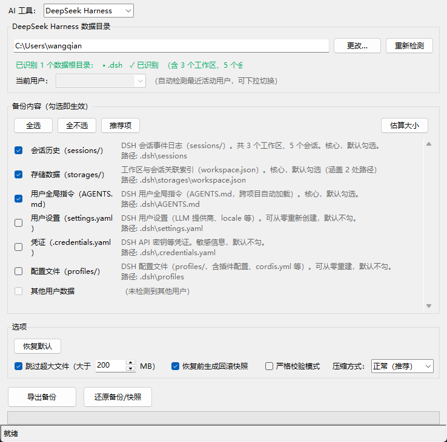

# AiEnvClone 使用说明

> AiEnvClone 是一款跨电脑备份 / 迁移**国内** AI 编程工具记忆、历史、配置的小工具。它同时提供命令行与图形界面（tkinter），对运行环境**零第三方运行时依赖**，可打包为单文件 exe 直接拷贝到没有 Python 的 Windows 电脑上运行。
>
> 当前已支持：Qoder、CodeBuddy、Reasonix、DeepSeek Harness（DSH）。各工具的数据目录、备份范围、跨电脑处理细节不同，由内置的「适配器」分别处理——**你只需在界面顶部选对要备份 / 迁移的工具，其余交给本工具**。

---

## 1. 功能特性

- **多工具支持**：同一套界面备份 / 还原不同的国内 AI 编程工具，顶部「AI 工具」下拉切换。
- **跨电脑还原**：自动处理「登录用户 UUID 重映射」「全局索引文件合并」「深层长路径」等跨机器陷阱（见第 6 节），让你换电脑后历史会话、记忆、工作区都能正常打开。
- **默认不破坏目标**：还原采用「只增不删」策略，不覆盖目标机器已有的同路径数据（见第 5、6 节）。
- **增量 / 可选项**：按适配器默认勾选核心数据（会话、记忆、规则），插件 / 设置等可选，本地缓存 / 日志不备份。
- **单文件 exe**：无需安装 Python，双击 `dist/AiEnvClone.exe` 即可使用。

---

## 2. 支持的工具与运行环境

| 工具 | 显示名 | 数据目录（示例） | 备注 |
| --- | --- | --- | --- |
| Qoder | Qoder | `~/.qoder-cn` | 含 `shared_client` 多 UID |
| CodeBuddy | CodeBuddy | 项目级 `<project>/.codebuddy` + 全局 `~/.codebuddycn` | 记忆区单用户扁平 |
| Reasonix | Reasonix | `%LOCALAPPDATA%\reasonix` | 会话位于 `projects/<scope>/sessions/` |
| DeepSeek Harness | DeepSeek Harness | `~/.dsh` | 工作区名依赖全局索引 `workspace.json` |

> 表中目录为各工具默认位置，实际以本机为准。界面「数据目录」区会列出所选工具探测到的真实路径与「当前用户」标识。

**运行环境要求**：

- Windows 10/11（主要支持）；macOS / Linux 可运行源码模式、可执行 `build_exe.py` 在本平台打包对应产物。
- 图形界面：Windows 需有 Python 3.10+（源码模式）或直接使用打包好的 exe。
- 无需安装任何第三方 Python 包。

---

## 3. 安装与启动

### 方式一：使用打包好的 exe（推荐，目标电脑无需 Python）

1. 复制仓库里的 `dist/AiEnvClone.exe` 到目标电脑任意目录。
2. 双击运行即可。

### 方式二：源码模式（开发 / 调试）

1. 安装 Python 3.10+ 并加入 PATH。
2. 双击 `run.bat`，或命令行执行：

   ```powershell
   python -m ai_env_clone
   ```

> `run.bat` 的逻辑：若 `dist/AiEnvClone.exe` 存在则优先启动它，否则退回源码模式。

### 重新打包 exe

改动了源码后，若要生成新的 `dist/AiEnvClone.exe`，双击 `build.bat`（内部用 `build_exe.py` 调 PyInstaller 单文件打包）。各平台需各自打包，不能交叉编译。

---

## 4. 界面说明

启动后主界面大致分为如下区域（示意见下方截图）：

1. **AI 工具**：顶部下拉，切换要备份 / 迁移的 AI 工具（Qoder / CodeBuddy / Reasonix / DeepSeek Harness）。切换后「数据目录」「备份内容」「当前用户」等区域会按所选工具刷新。
2. **数据目录**：显示所选工具探测到的数据目录列表，以及「当前用户」标识（登录用户 UUID 等）。可手动增删目录后再备份 / 还原。
3. **备份内容**：勾选项，决定本次备份包含哪些数据（会话、记忆、规则、插件、设置等）。各工具的默认勾选由适配器决定，大体遵循「核心可重建数据默认勾、缓存 / 日志不列入」。
4. **压缩方式**：备份包压缩级别（如 仅存储 / 标准压缩）。仅影响体积与打包耗时，不影响还原结果。
5. **选项**：如「严格校验模式」（还原前对备份完整性做更严格检查）等开关。
6. **操作按钮**：「备份」「还原」以及进度 / 日志展示。



---

## 5. 备份与还原

### 5.1 备份（同电脑 / 换电脑前）

1. 顶部「AI 工具」选对要备份的工具。
2. 确认「数据目录」区域列出的路径无误（可手动增减）。
3. 在「备份内容」里勾选要包含的数据；其余保持默认即可。
4. 选择「压缩方式」。
5. 点「备份」，选择输出 zip 路径（默认形如 `<工具>_backup_<时间戳>.zip`）。

备份产物是一个普通 zip，可拷贝到 U 盘 / 另一台电脑。

> **敏感凭证提醒**：部分配置（如 CodeBuddy 的「自定义模型配置」`models.json`）可能直接含明文敏感凭证（apiKey、令牌、私人令牌等）。勾选这类项时，备份包会对敏感字段做**脱敏占位**（`***REDACTED***`），包内不含明文凭证，但模型条目仍保留。还原到目标机器后需在源机记下、并在目标机手动补填这些凭证，否则对应模型虽可见但无法使用。（环境变量引用形式（如 `${MY_API_KEY}`）原样保留，跨电脑只需目标机有同名环境变量即可。）
>
> **自动定位（默认开启）**：备份选项中「备份后定位敏感文件」默认勾选。若本次备份包含脱敏项，完成后本工具会**自动打开该文件所在文件夹并高亮文件、用默认编辑器打开文件，并尝试把光标定位到敏感字段（如 apiKey / 令牌）所在行**（已安装 VS Code 时通过 `code -g` 精确跳转），方便你手动记下凭证。不想自动打开文件时取消该勾选即可，届时仅弹文字提醒。

### 5.2 还原（换电脑 / 重装后）

1. 顶部「AI 工具」选**与备份时相同**的工具。
2. 点「还原」，选择备份 zip。
3. 确认「数据目录」指向**本机**该工具的数据目录（不是源电脑路径）。
4. 按需勾选「选项」（如严格校验）。
5. 点「开始还原」。

> **还原采用「只增不删」原则**：不会删除目标机器已有的、备份里没有的数据；对于被备份覆盖的文件，若该文件属于「可合并」类型（见 6.2），会合并而非整体覆盖；否则以「目标已有则不破坏、仅补入缺失」的方式处理。

---

## 6. 跨电脑还原的特别处理

不同工具的会话 / 工作区在组织方式上差异很大，直接整包还原到另一台电脑常踩坑。本工具按各工具适配器声明的机制分别处理以下三类典型问题（机制细节见 `README.md` 的「跨电脑还原」章节，这里只讲用户须知）：

### 6.1 登录用户 UUID 自动重映射

部分工具（如 CodeBuddy）的会话按**登录用户 UUID** 分目录存放。换电脑后用户 UUID 不同，本工具会自动把备份里的旧 UUID 重映射为本机当前登录用户 UUID，确保会话落到本机工具实际读取的目录。若本机从未登录过该工具（取不到 UUID），则保持原路径、不破坏备份。

> 用户无需任何操作；只要本机已登录该工具，还原后的会话即可正常打开。

### 6.2 全局索引文件合并

某些工具（如 DSH）的工作区名依赖全局索引文件（而非目录名）。若整体覆盖该索引，会抹掉本机原有工作区、使其变成「未分组」。本工具对这类索引文件走**合并而非覆盖**：保留本机原有条目，并入备份带来的源条目，定位字段（path/title）一律用本机真实路径。

> 用户无需任何操作；还原后源机器迁移来的工作区与本机原有工作区共存，都不会变「未分组」。

### 6.3 深层会话消息长路径修复（Windows）

部分工具（如 CodeBuddy）的会话消息路径层级很深，在 Windows 上易超过 260 字符限制导致读不到。本工具已对所有文件操作加长路径前缀，深层会话消息可完整备份与还原，用户无需关心。

---

## 7. 常见问题

- **还原后历史会话「看得到但点开没内容」**：通常是 6.1 的 UUID 死目录或 6.3 的长路径处理所致；跨用户场景确保本机已登录该工具。
- **还原后某些工作区变成「未分组」**：通常是 6.2 的全局索引被整体覆盖。本工具对支持合并的工具会保留并合并本机原有工作区。
- **界面没有「AI 工具」下拉 / 显示旧样式**：说明你运行的不是最新打包的 exe。请重新 `build.bat` 打包，或用 `run.bat` 走源码模式。
- **备份包很大**：检查是否勾选了插件 / 设置；本地缓存与日志默认不列入备份。
- **还原后 CodeBuddy 自定义模型「看得到但无法调用」**：多为该模型的敏感凭证（apiKey / 令牌等）在备份时被脱敏占位（安全设计），还原后需你在目标机重新填入对应凭证（或确保目标机有对应的环境变量引用，如 `${MY_API_KEY}`）。

---

## 8. 目录结构（仓库）

```
ai-env-clone/
├── ai_env_clone/          # 主包：core + adapters（各工具适配器）
├── docs/                  # 文档（含本说明与截图）
├── dist/AiEnvClone.exe    # 打包产物（Windows 单文件 exe）
├── run.bat                # 一键启动（优先 exe，否则源码）
├── build.bat              # 重新打包 exe
├── build_exe.py           # PyInstaller 打包脚本
├── requirements.txt       # 构建期依赖（仅 PyInstaller，运行时零依赖）
└── README.md              # 项目总览（含中英文）
```
