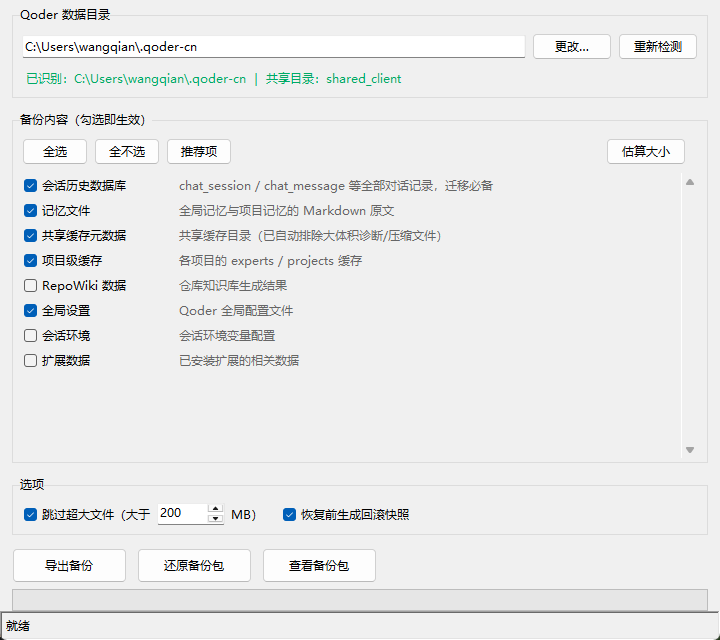
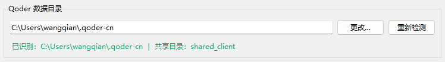
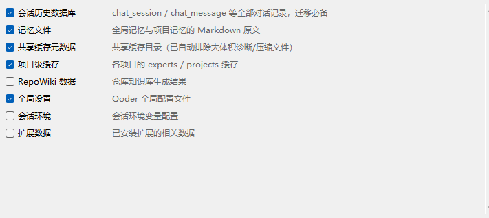
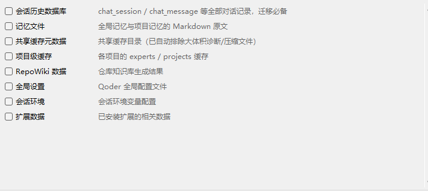

# Qoder 备份迁移工具 — 使用说明

> **用途**：一键备份 / 恢复 Qoder 的记忆文件、会话历史数据库与全局设置，支持跨电脑迁移。

---

## 1. 前置条件

| 项目 | 要求 |
|------|------|
| Python | **3.10+**（Windows 自带或自行安装） |
| 系统 | Windows / macOS / Linux |
| Qoder | 已安装并至少使用过一次（产生数据目录） |

无需安装任何第三方依赖，工具仅使用 Python 标准库（`tkinter`、`zipfile`、`sqlite3`）。

---

## 2. 启动方式

有三种启动方式，任选其一：

### 方式一：直接双击 exe（推荐，免命令）

如果你已经打包或获取到了 `QoderBackupTool.exe`，**双击即可运行，无需安装 Python，也无需输入任何命令**。

### 方式二：一键启动脚本（免命令）

项目内提供了 `run.bat`，**双击即可启动 GUI**。脚本会优先使用已打包的 `dist\QoderBackupTool.exe`，否则自动调用 Python 运行。

### 方式三：命令行

在项目目录下打开终端，执行：

```bash
python qoder_backup_tool.py
```

启动后界面如下：



> 工具会**自动探测**当前用户的 Qoder 数据目录（通常为 `C:\Users\<用户名>\.qoder-cn`），并在顶部显示识别结果。若自动检测失败，可点击「更改…」手动指定路径。

### 打包成 exe（可选）

若希望生成专属的 `QoderBackupTool.exe` 供他人免环境使用：

```bash
pip install -r requirements.txt     # 安装打包依赖 PyInstaller
python build_exe.py                 # 生成 dist/QoderBackupTool.exe
```

生成后把 `dist/QoderBackupTool.exe` 复制到其他 Windows 机器即可双击运行（免装 Python）。

---

## 3. 界面说明

### 3.1 数据目录区



- **路径框**：显示当前识别到的 Qoder 根目录。
- **更改…**：手动选择其他位置的 `.qoder-cn` 或 `.qoder` 目录。
- **重新检测**：重新扫描目录布局（适用于刚安装完 Qoder 后首次使用）。
- **状态提示行**：绿色表示已成功识别；红色表示未找到。

### 3.2 备份内容列表



每个条目对应一类数据：

| 模块 | 说明 | 是否默认勾选 |
|------|------|:----------:|
| 会话历史数据库 | `chat_session` / `chat_message` 全部对话记录 | ✅ |
| 记忆文件 | 全局记忆与项目记忆的 Markdown 原文 | ✅ |
| 代码索引数据库 | `shared_client/index` 下的代码语义索引（.db/.bolt/.zap/.json），迁移后可免重新构建索引 | ✅ |
| 共享缓存元数据 | 共享缓存目录（已自动排除大体积诊断/压缩文件） | ✅ |
| 项目级缓存 | 各项目的 experts / projects 缓存 | ✅ |
| RepoWiki 数据 | 仓库知识库生成结果 | ❌ |
| 全局设置 | `settings.json` 配置文件 | ✅ |
| 会话环境 | 会话环境变量配置 | ❌ |
| 扩展数据 | 已安装扩展的相关数据 | ❌ |

- 未找到的模块会以灰色禁用状态显示。
- 「全选」「全不选」「推荐项」按钮用于快速切换勾选。

点击「全不选」后效果如下——所有复选框清空：



### 3.3 工具栏


| 按钮 | 功能 |
|------|------|
| **全选** | 一键勾选所有已存在的模块 |
| **全不选** | 一键取消所有勾选 |
| **推荐项** | 仅勾选推荐备份的核心模块（会话历史 + 记忆文件 + 缓存 + 设置） |
| **估算大小** | 扫描勾选项的实际文件数和总体积（不打包），结果展示在底部状态栏 |

点击「估算大小」后，状态栏会显示扫描结果：


> 上图示例：待备份 846 个文件，约 493.3 MB；自动跳过了 8 个噪音 / 超大文件（411.1 MB）。

### 3.4 操作按钮


| 按钮 | 功能 |
|------|------|
| **导出备份** | 将勾选的模块打包成 zip 文件 |
| **还原备份包** | 从 zip 文件**一键自动解压覆盖**恢复到当前 Qoder 目录，**无需手动解压** |
| **查看备份包** | 打开一个已有的 zip 文件，预览其内容摘要 |

### 3.5 选项


- **跳过超大文件（大于 □ MB）**：默认开启，阈值**默认可编辑为 200 MB**。你可以根据磁盘空间和备份需求调整该数值（单位 MB）。设为 `0` 或取消勾选表示不限制，超大文件也会一并纳入。该限制**仅作用于普通大文件（诊断转储、压缩包等）**，**会话数据库（local.db 及其配套文件 local.db-wal / local.db-shm）不受此限制，始终被完整备份**。
- **恢复前生成回滚快照**：默认开启。还原时会先把即将被覆盖的原文件打包成回滚 zip，万一恢复后发现问题可以还原。

---

## 4. 使用流程

### 4.1 导出备份（从旧电脑）

1. 运行工具，确认「Qoder 数据目录」正确。
2. 在「备份内容」中勾选需要迁移的模块（建议保持默认的推荐项）。
3. 点击 **导出备份**，选择保存位置和文件名。
4. 等待进度条走完 → 弹出完成提示，记录下 zip 文件位置。

> **提示**：点击「估算大小」可以先看到将要打包多少文件、总体积多大，再决定是否调整勾选。

> ⚠️ **备份前也请完全退出 Qoder**：会话数据库采用 SQLite WAL 模式，Qoder 运行时未合并的会话会临时存在 `local.db-wal` 中。完全退出后这些记录才会合并进 `local.db`，确保备份到的会话历史是**完整**的。备份工具会自动一并收集 `local.db` / `local.db-wal` / `local.db-shm` 三个配套文件，但完全退出能让数据处于最干净一致的状态。

### 4.2 还原备份包（到新电脑）

1. 在新电脑上安装好 Qoder 并**至少运行一次**（让数据目录结构就绪）。
2. 运行本工具（双击 `QoderBackupTool.exe` 或 `run.bat`），确认数据目录指向新电脑的 `.qoder-cn`。
3. 点击 **还原备份包**，选择旧电脑导出的 zip 文件。
4. 弹出确认对话框（已说明将**自动解压覆盖，无需手动解压**）→ 点「是」→ 等待进度条完成。
5. **重启 Qoder**，检查记忆与会话是否正常加载。

> ⚠️ **重要**：还原前请确保 Qoder **完全退出**（包括托盘图标）。正在运行的进程写入会导致数据库损坏。本工具会**自动把备份包解压并写入目标目录**，你不需要、也不应该手动解压后再复制。

---

## 5. 迁移场景示意


---

## 6. 回滚机制

当「恢复前生成回滚快照」选项开启时，导入会在覆盖前自动创建一个名为 `qoder_rollback_<时间戳>.zip` 的快照文件，存放在 Qoder 根目录内。

**如何回滚**：
1. 用本工具的「还原备份包」功能选择该回滚 zip，即可一键还原被覆盖前的版本（同样无需手动解压）。
2. 也可使用「查看备份包」先预览回滚内容。

> 如果不需要回滚功能（例如全新安装、目标目录为空），可以在选项中关闭它以加快速度。

---

## 7. 安全特性

| 特性 | 说明 |
|------|------|
| **Zip Slip 防护** | 恢复时严格校验归档内路径，拒绝包含 `..`、绝对路径等穿越攻击的恶意 zip |
| **SQLite 一致性快照** | 即使 Qoder 正在运行，也会使用 SQLite 在线备份 API 获取一致的数据库副本，不会复制损坏的数据 |
| **噪音过滤** | 自动跳过 `- 副本` 文件夹、`.7z`/`.zip` 二次压缩包、`diagnosis*.bin` 诊断转储、日志和临时文件 |
| **关键库豁免** | 会话数据库（local.db 及其配套 local.db-wal / local.db-shm）无论多大都会被完整备份，不会被大小限制误过滤。三者作为整体一起备份与还原，缺一不可 |
| **原子写入** | 导出时先写临时文件，完成后才替换目标名，避免中断导致半成品 |

---

## 8. 常见问题

**Q: 提示「未找到 Qoder 数据目录」怎么办？**
A: 点击「更改…」，手动选择 Qoder 的数据目录。通常在用户主目录下的 `.qoder-cn`（国内版）或 `.qoder`（国际版）文件夹。

**Q: 备份包很大怎么办？**
A: 默认已开启「跳过超大文件」，阈值默认 200 MB。如果仍然过大，可取消勾选「共享缓存元数据」和「项目级缓存」（这两类可在 Qoder 重启后自动重建），或在选项中把阈值调小。

**Q: 导入后 Qoder 显示异常？**
A: 先用回滚快照还原，然后确认导入前 Qoder 已完全退出。如果问题持续，尝试只勾选「会话历史数据库」+「记忆文件」两项做最小化恢复。

**Q: 报错 `main thread is not in main loop` 怎么办？**
A: 这是旧版本的缺陷（后台线程访问了界面控件），当前版本已修复。若仍遇到，请确认使用的是最新的 `qoder_backup_tool.py`。另外，任务执行期间点击关闭窗口，工具会先弹出确认提示，请勿强制结束进程。

**Q: 不想输命令，有没有双击就能运行的版本？**
A: 有。双击项目里的 `run.bat` 即可一键启动；或运行 `python build_exe.py` 打包出 `QoderBackupTool.exe`，之后双击 exe 即可免装 Python 运行。

**Q: 能否在 Mac 和 Windows 之间互迁？**
A: 可以。zip 内部使用正斜杠相对路径，跨平台兼容。但注意 Qoder 版本需一致（均为国内版或均为国际版）。

**Q: 支持命令行调用吗？**
A: 支持。核心逻辑在 `qoder_backup_core.py` 中，可直接被 Python 脚本 import 调用，无需 GUI。示例：

```python
from qoder_backup_core import (
    detect_qoder_root, build_items,
    export_backup, import_backup
)
paths = detect_qoder_root()
items = [i for i in build_items(paths) if i.exists]
mf = export_backup("backup.zip", items, paths.root)
print(f"已备份 {mf['file_count']} 个文件")
```
